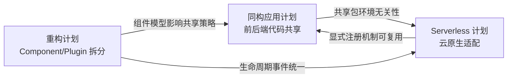
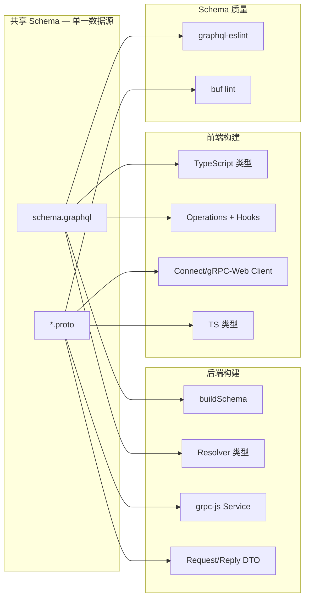
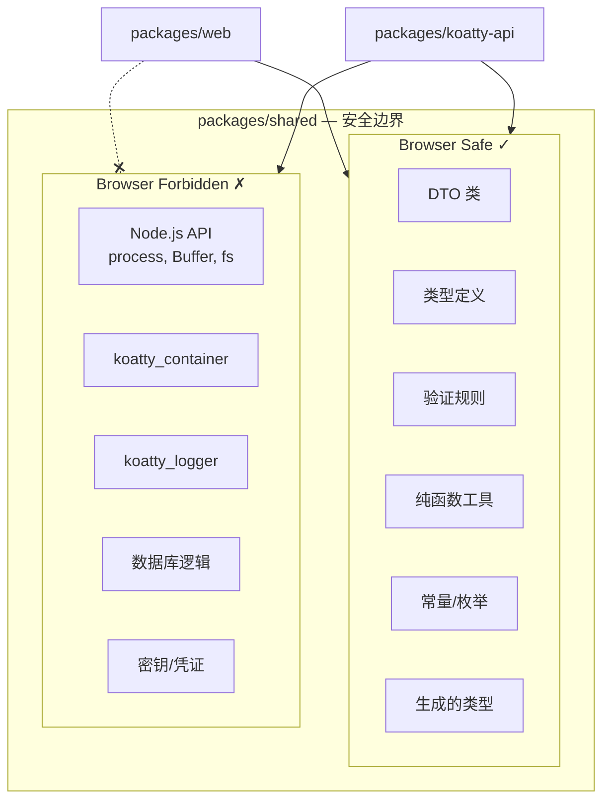
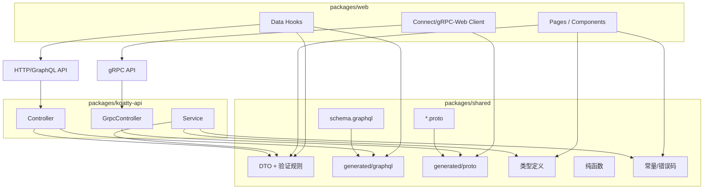
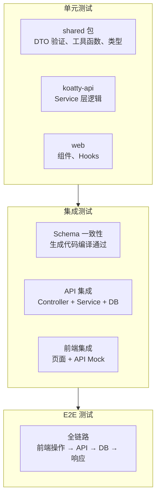
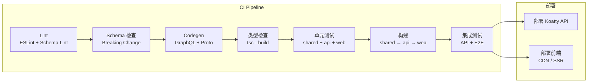

# Koatty 框架前后端同构应用支持方案

> **版本**：v2.0（增强版）
> **状态**：草案
> **关联文档**：[REFACTORING_PLAN.md](../../../docs/REFACTORING_PLAN.md)、[SERVERLESS_IMPLEMENTATION_PLAN.md](./SERVERLESS_IMPLEMENTATION_PLAN.md)

---

## 一、同构应用定义与目标

### 1.1 什么是前后端同构

**前后端同构（Isomorphic / Universal Application）** 指同一套类型定义、业务逻辑、验证规则等可在服务端（Node.js）与客户端（Browser）复用，实现：

- **类型共享**：DTO、API 契约、GraphQL Schema 前后端统一
- **验证共享**：表单校验与接口校验使用同一套规则
- **逻辑共享**：工具函数、状态计算等无环境依赖部分可复用
- **渲染同构**：可选 SSR，首屏服务端渲染 + 客户端 Hydration

### 1.2 Koatty 当前架构概览

| 模块 | 职责 | 浏览器兼容性 |
|------|------|--------------|
| koatty / koatty-core | 应用框架、路由、中间件 | 仅 Node.js |
| koatty_container | IOC 容器、DI、AOP | 仅 Node.js |
| koatty_validation | DTO 验证（class-validator） | 依赖 koatty_container，需拆分 |
| koatty_graphql | GraphQL Schema 解析与 TS codegen | SDL 解析部分可抽离 |
| koatty_proto | Proto 解析、DTO 生成 | 后端专用；前端用 buf/grpc-web 生成 |
| koatty_exception | 错误处理、HTTP 状态码 | 可抽离纯类型与工具 |
| koatty_lib | 辅助函数（isClass, toNumber 等） | 部分函数可复用 |
| static 目录 | 静态资源 | 与前端构建产物对接 |

### 1.3 目标

| 优先级 | 目标 | 说明 |
|--------|------|------|
| P0 | Monorepo 下前后端代码共享 | Schema、DTO、类型、验证规则统一管理 |
| P0 | Schema 为单一数据源 | `schema.graphql` 与 `*.proto` 驱动前后端代码生成 |
| P1 | DTO/验证规则前后端复用 | 同一份验证逻辑服务端与浏览器可用 |
| P1 | API 契约类型安全 | 前端请求、后端响应完整类型链路 |
| P2 | 可选 SSR 集成 | React/Vue 等服务端渲染，从 API 模式平滑过渡 |
| P2 | 与 Serverless 方案兼容 | 共享包在 Serverless 环境同样可用 |

### 1.4 与其他计划的关系

本方案与以下两个计划存在紧密关联，实施时须统一协调：



| 关联计划 | 影响点 | 协调策略 |
|----------|--------|----------|
| 重构计划 | Component/Plugin 拆分影响共享包设计 | 共享包不依赖任何 Component/Plugin 机制 |
| 重构计划 | `@OnEvent` 生命周期统一 | SSR 中间件遵循新的事件机制 |
| Serverless 计划 | 显式组件注册 | 同构构建可复用显式注册策略 |
| Serverless 计划 | 构建顺序 shared → api → web | CI/CD pipeline 统一管理 |
| Serverless 计划 | esbuild 打包策略 | 共享包需兼容 esbuild 的 tree-shaking |

---

## 二、总体架构设计

### 2.1 Schema 驱动构建（核心原则）

**schema.graphql** 与 **schema.proto** 作为契约层，是前后端生成的唯一来源：

| Schema 类型 | 用途 | 后端产物 | 前端产物 |
|-------------|------|----------|----------|
| schema.graphql | GraphQL API 契约 | buildSchema、Resolver 类型 | TS 类型、Hooks、Client |
| *.proto | gRPC API 契约 | Service 实现、Request/Reply DTO | gRPC-Web / Connect Client、TS 类型 |



#### Schema 管理策略

| 策略 | 说明 |
|------|------|
| 版本管理 | Schema 文件纳入 Git，变更走 PR Review |
| Lint 校验 | GraphQL 使用 `@graphql-eslint/eslint-plugin`；Proto 使用 `buf lint` |
| Breaking Change | 通过 `buf breaking` 或 `graphql-inspector` 检测不兼容变更 |
| 变更通知 | CI 中 Schema 变更触发前后端联动构建与测试 |
| 文档生成 | GraphQL 使用 `graphql-voyager` 或 `SpectaQL`；Proto 使用 `buf docs` |

### 2.2 Monorepo 目录结构

```
<project>
├── packages/
│   ├── shared/                    # 共享包（Schema + 生成产物 + 共享逻辑）
│   │   ├── schema/                # Schema 源文件（单一数据源）
│   │   │   ├── graphql/
│   │   │   │   ├── schema.graphql
│   │   │   │   └── operations/    # 前端查询/变更操作定义
│   │   │   │       ├── queries.graphql
│   │   │   │       └── mutations.graphql
│   │   │   └── proto/
│   │   │       ├── buf.yaml       # buf 配置
│   │   │       ├── buf.gen.yaml   # buf 代码生成配置
│   │   │       ├── user.proto
│   │   │       └── common.proto
│   │   ├── src/
│   │   │   ├── dto/               # 手写 DTO（非 Schema 生成部分）
│   │   │   ├── validation/        # 验证规则（browser-safe）
│   │   │   ├── types/             # 公共类型（API 响应、错误码等）
│   │   │   ├── utils/             # 纯函数工具
│   │   │   └── constants/         # 共享常量（错误码、状态枚举）
│   │   ├── generated/             # 由 Schema 生成的代码（构建产物，.gitignore）
│   │   │   ├── graphql/           # GraphQL codegen 产出
│   │   │   └── proto/             # buf/protoc 产出
│   │   ├── scripts/               # 生成脚本
│   │   │   ├── codegen-graphql.ts
│   │   │   └── codegen-proto.ts
│   │   ├── package.json           # 含 conditional exports
│   │   ├── tsconfig.json
│   │   └── .eslintrc.js           # 禁止 Node.js 内置模块
│   │
│   ├── koatty-api/                # Koatty 后端
│   │   ├── src/
│   │   │   ├── controller/
│   │   │   ├── service/
│   │   │   ├── middleware/
│   │   │   ├── config/
│   │   │   └── App.ts
│   │   ├── static/                # 生产时由 web 构建产物填充
│   │   ├── package.json
│   │   └── tsconfig.json
│   │
│   └── web/                       # 前端（React/Vue/Svelte 等）
│       ├── src/
│       │   ├── pages/
│       │   ├── components/
│       │   ├── hooks/
│       │   ├── api/               # 请求封装
│       │   └── main.tsx
│       ├── vite.config.ts
│       ├── package.json
│       └── tsconfig.json
│
├── .github/
│   └── workflows/
│       ├── ci.yml                 # CI pipeline
│       └── schema-check.yml       # Schema 变更检测
├── package.json
├── pnpm-workspace.yaml
└── turbo.json                     # Turborepo 构建编排
```

### 2.3 安全边界设计

共享包需要严格的安全边界，确保后端专用逻辑不会泄漏到前端 bundle：



#### 安全保障措施

| 措施 | 实现方式 |
|------|----------|
| ESLint 规则 | `no-restricted-imports` 禁止 `fs`、`path`、`koatty_*` 等 |
| Conditional Exports | `package.json` 的 `exports` 字段区分 `browser` / `node` |
| 构建检查 | CI 中检测前端 bundle 是否包含 Node.js polyfill |
| Code Review | Schema 和 shared 包变更需 Review |

### 2.4 数据流与依赖关系



---

## 三、核心实施方案

### 3.1 共享包（packages/shared）设计

#### 3.1.1 环境无依赖约束

共享包内代码需满足：

- 不使用 `process`、`Buffer`、`fs`、`path` 等 Node 内置模块
- 不使用 `koatty_container`、`koatty_logger` 等仅服务端依赖
- 验证逻辑使用 `class-validator` 纯函数或可 tree-shake 的轻量封装
- 所有导出均为纯类型或无副作用函数

**ESLint 强制约束：**

```javascript
// packages/shared/.eslintrc.js
module.exports = {
  rules: {
    'no-restricted-imports': ['error', {
      patterns: [
        'koatty*',           // 禁止依赖 Koatty 框架模块
        'fs', 'path', 'os',  // 禁止 Node.js 内置模块
        'net', 'http', 'https', 'stream',
        '@grpc/*',           // 禁止 gRPC 服务端库
      ],
    }],
    'no-restricted-globals': ['error', 'process', 'Buffer', '__dirname', '__filename'],
  },
};
```

#### 3.1.2 Conditional Exports（条件导出）

共享包的 `package.json` 使用条件导出，确保浏览器和 Node.js 引用正确的代码：

```json
{
  "name": "@project/shared",
  "type": "module",
  "exports": {
    ".": {
      "types": "./dist/index.d.ts",
      "browser": "./dist/index.browser.mjs",
      "import": "./dist/index.mjs",
      "require": "./dist/index.cjs"
    },
    "./dto": {
      "types": "./dist/dto/index.d.ts",
      "import": "./dist/dto/index.mjs"
    },
    "./types": {
      "types": "./dist/types/index.d.ts",
      "import": "./dist/types/index.mjs"
    },
    "./validation": {
      "types": "./dist/validation/index.d.ts",
      "import": "./dist/validation/index.mjs"
    },
    "./generated/graphql": {
      "types": "./generated/graphql/index.d.ts",
      "import": "./generated/graphql/index.mjs"
    },
    "./generated/proto": {
      "types": "./generated/proto/index.d.ts",
      "import": "./generated/proto/index.mjs"
    },
    "./schema/*": "./schema/*"
  },
  "sideEffects": false
}
```

> `sideEffects: false` 确保打包工具可安全 tree-shake 未使用的导出。

#### 3.1.3 DTO 与验证

**推荐方案：class-validator 直接复用 + 轻量适配层**

选择理由：
- `class-validator` 本身是环境无关的，无需框架依赖
- `class-transformer` 提供 `plainToInstance`，前后端通用
- 避免拆分 `koatty_validation` 带来的维护成本
- Koatty 后端侧通过适配层桥接 `@Validated` 装饰器

```typescript
// packages/shared/src/dto/user.dto.ts
import { IsEmail, IsNotEmpty, IsOptional, MinLength, MaxLength } from 'class-validator';
import { Type } from 'class-transformer';

export class CreateUserDto {
  @IsNotEmpty({ message: '用户名不能为空' })
  @MinLength(3, { message: '用户名至少3个字符' })
  @MaxLength(50, { message: '用户名最多50个字符' })
  username!: string;

  @IsEmail({}, { message: '邮箱格式不正确' })
  email!: string;

  @IsOptional()
  @MinLength(6, { message: '密码至少6个字符' })
  password?: string;
}

export class UserResponseDto {
  id!: string;
  username!: string;
  email!: string;

  @Type(() => Date)
  createdAt!: Date;
}
```

**前端使用（表单校验）：**

```typescript
// packages/web/src/hooks/useFormValidation.ts
import { validate, ValidationError } from 'class-validator';
import { plainToInstance, ClassConstructor } from 'class-transformer';

export interface ValidationResult {
  valid: boolean;
  errors: Record<string, string[]>;
  firstErrors: Record<string, string>;
}

export async function validateDto<T extends object>(
  DtoClass: ClassConstructor<T>,
  raw: Record<string, unknown>,
): Promise<ValidationResult> {
  const instance = plainToInstance(DtoClass, raw);
  const validationErrors = await validate(instance);

  const errors: Record<string, string[]> = {};
  const firstErrors: Record<string, string> = {};

  for (const e of validationErrors) {
    if (e.property && e.constraints) {
      const messages = Object.values(e.constraints);
      errors[e.property] = messages;
      firstErrors[e.property] = messages[0];
    }
    // 处理嵌套对象验证
    if (e.children?.length) {
      flattenValidationErrors(e.children, e.property, errors, firstErrors);
    }
  }

  return {
    valid: validationErrors.length === 0,
    errors,
    firstErrors,
  };
}

function flattenValidationErrors(
  children: ValidationError[],
  prefix: string,
  errors: Record<string, string[]>,
  firstErrors: Record<string, string>,
): void {
  for (const child of children) {
    const key = `${prefix}.${child.property}`;
    if (child.constraints) {
      const messages = Object.values(child.constraints);
      errors[key] = messages;
      firstErrors[key] = messages[0];
    }
    if (child.children?.length) {
      flattenValidationErrors(child.children, key, errors, firstErrors);
    }
  }
}
```

**后端使用（Controller）：**

```typescript
// packages/koatty-api/src/controller/UserController.ts
import { Controller, PostMapping, RequestBody, Validated } from 'koatty';
import { CreateUserDto } from '@project/shared/dto';

@Controller('/api')
export class UserController {
  @PostMapping('/users')
  @Validated()
  async create(@RequestBody() dto: CreateUserDto) {
    return this.ok(dto);
  }
}
```

**备选方案：koatty_validation 拆分（若需深度 IOC 集成）**

若需在浏览器端保留 `@Validated` 等装饰器体验，可将 `koatty_validation` 拆分为：

```
koatty_validation_core (新包)
├── ClassValidator       # class-validator 封装
├── FunctionValidator    # 自定义函数验证
├── 验证装饰器           # @Valid 等，不依赖 IOC
├── plainToClass()       # 类型转换（不依赖 PARAM_TYPE_KEY）
└── package.json         # exports.browser 字段

koatty_validation (现有包，依赖 core)
├── IOC 集成             # PARAM_CHECK_KEY、PARAM_RULE_KEY
├── @Validated() AOP     # 依赖 koatty_container
└── checkValidated()     # 参数验证 + IOC 元数据
```

> **注意**：`reflect-metadata` 在浏览器端需要 polyfill。若使用方案 B，需在前端入口文件 `import 'reflect-metadata'`，并确认对 bundle size 的影响（约 +8KB gzipped）。

#### 3.1.4 GraphQL Schema 共享

**单一数据源**：`packages/shared/schema/graphql/schema.graphql`

```graphql
# packages/shared/schema/graphql/schema.graphql
type Query {
  user(id: ID!): User
  users(filter: UserFilter, pagination: PaginationInput): UserConnection!
}

type Mutation {
  createUser(input: CreateUserInput!): UserPayload!
  updateUser(id: ID!, input: UpdateUserInput!): UserPayload!
  deleteUser(id: ID!): DeletePayload!
}

type User {
  id: ID!
  username: String!
  email: String!
  createdAt: DateTime!
  updatedAt: DateTime!
}

# 输入类型
input CreateUserInput {
  username: String!
  email: String!
  password: String!
}

input UpdateUserInput {
  username: String
  email: String
}

input UserFilter {
  username: String
  email: String
}

input PaginationInput {
  page: Int = 1
  pageSize: Int = 20
}

# 分页响应
type UserConnection {
  items: [User!]!
  total: Int!
  page: Int!
  pageSize: Int!
  hasNext: Boolean!
}

# 操作响应
type UserPayload {
  code: Int!
  message: String!
  data: User
}

type DeletePayload {
  code: Int!
  message: String!
  affected: Int!
}

# 自定义标量
scalar DateTime
```

**前端 Operations 定义**（与 Schema 分离）：

```graphql
# packages/shared/schema/graphql/operations/queries.graphql
query GetUser($id: ID!) {
  user(id: $id) {
    id
    username
    email
    createdAt
  }
}

query ListUsers($filter: UserFilter, $pagination: PaginationInput) {
  users(filter: $filter, pagination: $pagination) {
    items {
      id
      username
      email
    }
    total
    page
    pageSize
    hasNext
  }
}
```

```graphql
# packages/shared/schema/graphql/operations/mutations.graphql
mutation CreateUser($input: CreateUserInput!) {
  createUser(input: $input) {
    code
    message
    data {
      id
      username
      email
    }
  }
}
```

**GraphQL Codegen 配置**（支持多框架）：

```typescript
// packages/shared/codegen.ts
import type { CodegenConfig } from '@graphql-codegen/cli';

const config: CodegenConfig = {
  schema: './schema/graphql/schema.graphql',
  documents: './schema/graphql/operations/**/*.graphql',
  generates: {
    // 基础类型（框架无关）
    './generated/graphql/types.ts': {
      plugins: ['typescript'],
      config: {
        scalars: {
          DateTime: 'string',
        },
        enumsAsTypes: true,
        strictScalars: true,
      },
    },
    // Operations 类型
    './generated/graphql/operations.ts': {
      plugins: ['typescript-operations'],
      preset: 'import-types',
      presetConfig: {
        typesPath: './types',
      },
    },
    // React Apollo Hooks（可选，按需启用）
    './generated/graphql/react.ts': {
      plugins: ['typescript-react-apollo'],
      preset: 'import-types',
      presetConfig: {
        typesPath: './types',
      },
      config: {
        withHooks: true,
        withComponent: false,
      },
    },
    // Vue Composition API（可选，按需启用）
    // './generated/graphql/vue.ts': {
    //   plugins: ['typescript-vue-apollo'],
    // },
  },
};

export default config;
```

**后端**：直接加载同一 Schema 文件

```typescript
// koatty-api/config/router.ts
export default {
  ext: {
    graphql: {
      schemaFile: require.resolve('@project/shared/schema/graphql/schema.graphql'),
    },
  },
};
```

**GraphQL Schema Lint**：

```yaml
# packages/shared/.graphql-eslint.yml
rules:
  naming-convention:
    - error
    - types: PascalCase
      FieldDefinition: camelCase
      InputValueDefinition: camelCase
      EnumValueDefinition: UPPER_CASE
  no-unreachable-types: error
  no-duplicate-fields: error
  require-description:
    - warn
    - types: true
      FieldDefinition: true
```

#### 3.1.5 Proto Schema 共享

**推荐工具链：buf（替代 protoc + grpc-web）**

选择 `buf` 的理由：
- 统一的 lint / breaking change 检测 / 代码生成
- 支持 `connect-web`（比 grpc-web 更现代，纯 TypeScript，支持 fetch API）
- 更好的 TypeScript 支持（生成的代码无需额外类型包装）

**单一数据源**：`packages/shared/schema/proto/*.proto`

```protobuf
// packages/shared/schema/proto/user.proto
syntax = "proto3";
package user.v1;

import "google/protobuf/timestamp.proto";

service UserService {
  rpc GetUser (GetUserRequest) returns (User);
  rpc ListUsers (ListUsersRequest) returns (ListUsersResponse);
  rpc CreateUser (CreateUserRequest) returns (UserPayload);
  rpc DeleteUser (DeleteUserRequest) returns (DeletePayload);
}

message GetUserRequest {
  string id = 1;
}

message ListUsersRequest {
  optional string username_filter = 1;
  int32 page = 2;
  int32 page_size = 3;
}

message ListUsersResponse {
  repeated User items = 1;
  int32 total = 2;
  int32 page = 3;
  int32 page_size = 4;
  bool has_next = 5;
}

message CreateUserRequest {
  string username = 1;
  string email = 2;
  string password = 3;
}

message DeleteUserRequest {
  string id = 1;
}

message User {
  string id = 1;
  string username = 2;
  string email = 3;
  google.protobuf.Timestamp created_at = 4;
}

message UserPayload {
  int32 code = 1;
  string message = 2;
  optional User data = 3;
}

message DeletePayload {
  int32 code = 1;
  string message = 2;
  int32 affected = 3;
}
```

**buf 配置**：

```yaml
# packages/shared/schema/proto/buf.yaml
version: v2
lint:
  use:
    - DEFAULT
  except:
    - PACKAGE_VERSION_SUFFIX
breaking:
  use:
    - FILE
```

```yaml
# packages/shared/schema/proto/buf.gen.yaml
version: v2
plugins:
  # 后端：grpc-js 服务定义
  - local: protoc-gen-ts
    out: ../../generated/proto
    opt:
      - target=server
      - output_javascript=false
  # 前端：connect-web Client
  - remote: buf.build/connectrpc/es
    out: ../../generated/proto/connect
    opt:
      - target=ts
  # TypeScript 类型
  - remote: buf.build/bufbuild/es
    out: ../../generated/proto/connect
    opt:
      - target=ts
```

**前端调用（Connect-Web，推荐）：**

```typescript
// packages/web/src/api/grpcClient.ts
import { createPromiseClient } from '@connectrpc/connect';
import { createConnectTransport } from '@connectrpc/connect-web';
import { UserService } from '@project/shared/generated/proto/connect/user_connect';

const transport = createConnectTransport({
  baseUrl: import.meta.env.VITE_API_URL ?? 'https://api.example.com',
});

export const userClient = createPromiseClient(UserService, transport);

// 使用示例
const user = await userClient.getUser({ id: '1' });
const list = await userClient.listUsers({ page: 1, pageSize: 20 });
```

> **与传统 gRPC-Web 的对比**：
> - Connect-Web 使用标准 HTTP/1.1 + JSON 或 Protobuf 编码，**无需 Envoy 等代理**
> - 支持 `fetch` API，兼容所有现代浏览器
> - 类型安全更好，生成的代码更简洁
> - Koatty 后端需添加 Connect 协议支持（可通过中间件实现）

**兼容方案：传统 gRPC-Web（若已有 Envoy 基础设施）：**

```typescript
// packages/web/src/api/grpcWebClient.ts
import { UserServiceClient } from '@project/shared/generated/proto/UserServiceClientPb';
import { GetUserRequest } from '@project/shared/generated/proto/user_pb';

const client = new UserServiceClient(
  import.meta.env.VITE_GRPC_WEB_URL ?? 'https://api.example.com',
);

const req = new GetUserRequest();
req.setId('1');
const user = await client.getUser(req, {});
```

> **注意**：传统 gRPC-Web 需要 Envoy 或 grpc-web-proxy 作为反向代理，且不支持客户端流式传输。

#### 3.1.6 统一构建脚本

```json
{
  "scripts": {
    "codegen": "npm run codegen:graphql && npm run codegen:proto",
    "codegen:graphql": "graphql-codegen --config codegen.ts",
    "codegen:proto": "buf generate --path schema/proto",
    "codegen:watch": "graphql-codegen --config codegen.ts --watch",
    "lint:schema": "npm run lint:graphql && npm run lint:proto",
    "lint:graphql": "eslint --ext .graphql schema/graphql/",
    "lint:proto": "buf lint schema/proto",
    "check:breaking": "buf breaking schema/proto --against '.git#subpath=packages/shared/schema/proto'",
    "prebuild": "npm run codegen",
    "build": "tsup src/index.ts --format cjs,esm --dts --clean",
    "clean": "rimraf dist generated"
  }
}
```

根目录 Turbo 编排：

```json
// turbo.json
{
  "pipeline": {
    "@project/shared#codegen": {
      "outputs": ["generated/**"]
    },
    "@project/shared#build": {
      "dependsOn": ["codegen"],
      "outputs": ["dist/**"]
    },
    "koatty-api#build": {
      "dependsOn": ["@project/shared#build"],
      "outputs": ["dist/**"]
    },
    "web#build": {
      "dependsOn": ["@project/shared#build"],
      "outputs": ["dist/**"]
    }
  }
}
```

#### 3.1.7 API 响应格式统一

```typescript
// packages/shared/src/types/api.ts

/** 统一 API 响应格式 */
export interface ApiResponse<T = unknown> {
  code: number;
  message: string;
  data: T | null;
}

/** 分页响应格式 */
export interface PaginatedResponse<T = unknown> {
  code: number;
  message: string;
  data: {
    items: T[];
    total: number;
    page: number;
    pageSize: number;
    hasNext: boolean;
  } | null;
}

/** 错误码枚举（前后端统一） */
export enum ErrorCode {
  SUCCESS = 0,
  BAD_REQUEST = 400,
  UNAUTHORIZED = 401,
  FORBIDDEN = 403,
  NOT_FOUND = 404,
  VALIDATION_ERROR = 422,
  INTERNAL_ERROR = 500,
  SERVICE_UNAVAILABLE = 503,
}

/** 错误码消息映射 */
export const ErrorMessages: Record<ErrorCode, string> = {
  [ErrorCode.SUCCESS]: 'success',
  [ErrorCode.BAD_REQUEST]: '请求参数错误',
  [ErrorCode.UNAUTHORIZED]: '未认证',
  [ErrorCode.FORBIDDEN]: '权限不足',
  [ErrorCode.NOT_FOUND]: '资源不存在',
  [ErrorCode.VALIDATION_ERROR]: '数据验证失败',
  [ErrorCode.INTERNAL_ERROR]: '服务器内部错误',
  [ErrorCode.SERVICE_UNAVAILABLE]: '服务不可用',
};

/** 工厂函数 */
export const createSuccessResponse = <T>(data: T, message = 'success'): ApiResponse<T> => ({
  code: ErrorCode.SUCCESS,
  message,
  data,
});

export const createErrorResponse = (
  code: ErrorCode,
  message?: string,
): ApiResponse<null> => ({
  code,
  message: message ?? ErrorMessages[code] ?? 'Unknown error',
  data: null,
});

export const createPaginatedResponse = <T>(
  items: T[],
  total: number,
  page: number,
  pageSize: number,
): PaginatedResponse<T> => ({
  code: ErrorCode.SUCCESS,
  message: 'success',
  data: {
    items,
    total,
    page,
    pageSize,
    hasNext: page * pageSize < total,
  },
});
```

后端 `Output.ok` / `Output.fail` 与上述类型对齐；前端据此做类型安全的请求封装。与 `koatty_exception` 的 `HttpStatusCode` 保持映射关系。

### 3.2 前端集成

#### 3.2.1 依赖声明

```json
{
  "name": "web",
  "dependencies": {
    "@project/shared": "workspace:*",
    "class-validator": "^0.14.3",
    "class-transformer": "^0.5.1",
    "reflect-metadata": "^0.2.2"
  }
}
```

#### 3.2.2 请求封装（类型安全）

```typescript
// packages/web/src/api/client.ts
import type { ApiResponse, PaginatedResponse, ErrorCode } from '@project/shared/types';

class ApiError extends Error {
  constructor(
    public code: ErrorCode,
    message: string,
    public data?: unknown,
  ) {
    super(message);
    this.name = 'ApiError';
  }
}

const BASE_URL = import.meta.env.VITE_API_URL ?? '/api';

export async function apiFetch<T>(
  url: string,
  options?: RequestInit,
): Promise<ApiResponse<T>> {
  const res = await fetch(`${BASE_URL}${url}`, {
    ...options,
    headers: {
      'Content-Type': 'application/json',
      ...options?.headers,
    },
  });

  const json: ApiResponse<T> = await res.json();

  if (!res.ok || json.code !== 0) {
    throw new ApiError(
      json.code as ErrorCode,
      json.message || `Request failed with status ${res.status}`,
      json.data,
    );
  }

  return json;
}

export async function apiPaginatedFetch<T>(
  url: string,
  params?: Record<string, string | number>,
): Promise<PaginatedResponse<T>> {
  const searchParams = new URLSearchParams();
  if (params) {
    for (const [key, value] of Object.entries(params)) {
      searchParams.set(key, String(value));
    }
  }

  const fullUrl = params ? `${url}?${searchParams.toString()}` : url;
  return apiFetch(fullUrl) as Promise<PaginatedResponse<T>>;
}
```

#### 3.2.3 表单校验复用（React Hook 示例）

```typescript
// packages/web/src/hooks/useFormValidation.ts
import { useState, useCallback } from 'react';
import { ClassConstructor } from 'class-transformer';
import { validateDto, type ValidationResult } from '../utils/validation';

export function useFormValidation<T extends object>(DtoClass: ClassConstructor<T>) {
  const [errors, setErrors] = useState<Record<string, string>>({});
  const [isValidating, setIsValidating] = useState(false);

  const validateField = useCallback(
    async (field: string, value: unknown) => {
      const result = await validateDto(DtoClass, { [field]: value });
      setErrors((prev) => {
        const next = { ...prev };
        if (result.firstErrors[field]) {
          next[field] = result.firstErrors[field];
        } else {
          delete next[field];
        }
        return next;
      });
      return !result.firstErrors[field];
    },
    [DtoClass],
  );

  const validateAll = useCallback(
    async (data: Record<string, unknown>): Promise<ValidationResult> => {
      setIsValidating(true);
      try {
        const result = await validateDto(DtoClass, data);
        setErrors(result.firstErrors);
        return result;
      } finally {
        setIsValidating(false);
      }
    },
    [DtoClass],
  );

  const clearErrors = useCallback(() => setErrors({}), []);

  return { errors, isValidating, validateField, validateAll, clearErrors };
}
```

### 3.3 可选：SSR 集成

#### 3.3.1 方案对比

| 方案 | 优点 | 缺点 | 推荐场景 |
|------|------|------|----------|
| Vite SSR | 轻量、灵活、与 Koatty 自然集成 | 需手动处理状态管理和数据预取 | Koatty 作为主服务，需精细控制 |
| Next.js | 生态完善，开箱即用 | 架构较重，与 Koatty 路由可能冲突 | 前端为主，API 较简单 |
| Nuxt | Vue 生态完善 | 同 Next.js | Vue 项目 |
| 自定义 renderToString | 最灵活 | 需大量基础设施代码 | 极致定制 |

> **推荐**：优先采用 Vite SSR，与 Koatty 的 Koa 中间件模型最易集成。

#### 3.3.2 架构

Koatty 作为 HTTP 服务，按路径前缀分发：

```
请求 → Koatty 中间件栈
         ├── /api/*      → REST/GraphQL Controller
         ├── /assets/*   → 静态资源（Vite 构建产物）
         └── /*          → SSR 渲染中间件
```

#### 3.3.3 SSR 中间件实现

```typescript
// packages/koatty-api/src/middleware/SsrMiddleware.ts
import { Middleware } from 'koatty';
import type { Koatty, KoattyContext, KoattyNext } from 'koatty';
import * as fs from 'fs';
import * as path from 'path';

@Middleware()
export class SsrMiddleware {
  run(options: SsrOptions, app: Koatty) {
    // 开发模式：创建 Vite Dev Server
    let vite: any;
    const isDev = app.env === 'development';
    const distPath = options.distPath ?? path.resolve(__dirname, '../../web/dist');

    return async (ctx: KoattyContext, next: KoattyNext) => {
      // 跳过 API 和静态资源
      if (ctx.path.startsWith('/api') || ctx.path.startsWith('/assets')) {
        return next();
      }

      try {
        let template: string;
        let render: (url: string, context: any) => Promise<SsrRenderResult>;

        if (isDev) {
          // 开发模式：Vite Dev Server 按需编译
          if (!vite) {
            const { createServer } = await import('vite');
            vite = await createServer({
              server: { middlewareMode: true },
              appType: 'custom',
            });
            // 注册 Vite 中间件到 Koatty
            app.useExp(vite.middlewares);
          }
          template = fs.readFileSync(path.resolve(distPath, '../index.html'), 'utf-8');
          template = await vite.transformIndexHtml(ctx.url, template);
          render = (await vite.ssrLoadModule('/src/entry-server.tsx')).render;
        } else {
          // 生产模式：加载预构建产物
          template = fs.readFileSync(path.resolve(distPath, 'client/index.html'), 'utf-8');
          render = (await import(path.resolve(distPath, 'server/entry-server.js'))).render;
        }

        const { html: appHtml, state, head } = await render(ctx.path, {
          // 传递请求上下文，用于数据预取
          headers: ctx.headers,
          cookies: ctx.cookies,
        });

        // 注入 SSR 内容
        const finalHtml = template
          .replace('<!--ssr-head-->', head ?? '')
          .replace('<!--ssr-outlet-->', appHtml)
          .replace(
            '<!--ssr-state-->',
            `<script>window.__SSR_STATE__=${JSON.stringify(state)}</script>`,
          );

        ctx.type = 'text/html';
        ctx.body = finalHtml;
      } catch (e) {
        if (isDev && vite) {
          vite.ssrFixStacktrace(e as Error);
        }
        // 降级到客户端渲染
        ctx.status = 500;
        ctx.body = isDev ? (e as Error).stack : 'Internal Server Error';
      }
    };
  }
}

interface SsrOptions {
  distPath?: string;
  fallbackToCSR?: boolean;
}

interface SsrRenderResult {
  html: string;
  state?: Record<string, unknown>;
  head?: string;
}
```

#### 3.3.4 数据预取与 Hydration

**服务端 Entry**：

```typescript
// packages/web/src/entry-server.tsx
import { renderToString } from 'react-dom/server';
import { StaticRouter } from 'react-router-dom/server';
import { App } from './App';
import { prefetchData } from './data-prefetch';

export async function render(
  url: string,
  context: { headers: Record<string, string>; cookies: any },
) {
  // 数据预取
  const state = await prefetchData(url, context);

  const html = renderToString(
    <StaticRouter location={url}>
      <App initialState={state} />
    </StaticRouter>,
  );

  return { html, state };
}
```

**客户端 Entry**：

```typescript
// packages/web/src/entry-client.tsx
import { hydrateRoot } from 'react-dom/client';
import { BrowserRouter } from 'react-router-dom';
import { App } from './App';

// 从 SSR 注入的全局变量读取预取数据
const ssrState = window.__SSR_STATE__;
delete window.__SSR_STATE__;

hydrateRoot(
  document.getElementById('root')!,
  <BrowserRouter>
    <App initialState={ssrState} />
  </BrowserRouter>,
);
```

#### 3.3.5 SSR 性能优化

| 策略 | 说明 |
|------|------|
| 页面级缓存 | 使用 LRU Cache 缓存 SSR 渲染结果，TTL 按页面类型配置 |
| 并发限制 | 限制同时进行的 SSR 渲染数量，避免内存溢出 |
| Streaming SSR | React 18+ 支持 `renderToPipeableStream`，分块发送 HTML |
| 降级策略 | SSR 超时或失败时降级为 CSR（返回空壳 HTML） |
| CDN 缓存 | 静态页面和 SSR 结果配合 CDN `Cache-Control` |

### 3.4 Koatty 侧改造建议

#### 3.4.1 配置扩展

```typescript
// config/config.ts - 同构相关配置
export default {
  isomorphic: {
    sharedPackage: '@project/shared',
    ssr: {
      enabled: false,
      entry: '../web/dist/server/entry-server.js',
      distPath: '../web/dist',
      cache: {
        enabled: true,
        maxAge: 60_000,     // 缓存 TTL (ms)
        maxItems: 100,      // LRU 容量
      },
      concurrency: 10,     // 最大并发 SSR 渲染数
      timeout: 5_000,      // SSR 渲染超时 (ms)，超时降级 CSR
    },
  },
};
```

#### 3.4.2 ComponentScan 排除

共享包中的 DTO 不应被扫描为 `@Component`，避免与 `@Service` 等冲突：

```typescript
// App.ts
@ComponentScan('./src')  // 仅扫描 src，不包含 node_modules/@project/shared
```

由于 `@ComponentScan` 基于文件系统扫描 `src/` 目录，且 shared 包通过 `node_modules` 引入，默认不会被扫描到。但需注意：

- 若使用 TypeScript `paths` 映射或 Monorepo 软链接，确认 scan 范围不包含 shared 包
- 在 tsconfig 中将 shared 排除出 `include` 的源码编译范围（仅引用其编译产物）

#### 3.4.3 开发代理配置

开发时 Koatty 代理前端 dev server，实现前后端协同开发：

```typescript
// config/config.ts (开发环境)
export default {
  proxy: {
    // 开发时将非 API 请求代理到 Vite Dev Server
    enabled: process.env.NODE_ENV === 'development',
    target: 'http://localhost:5173',
    exclude: ['/api', '/graphql', '/grpc'],
  },
};
```

或反向配置 — Vite 代理 API 请求到 Koatty：

```typescript
// packages/web/vite.config.ts
import { defineConfig } from 'vite';

export default defineConfig({
  server: {
    proxy: {
      '/api': {
        target: 'http://localhost:3000',
        changeOrigin: true,
      },
      '/graphql': {
        target: 'http://localhost:3000',
        changeOrigin: true,
      },
    },
  },
});
```

> **推荐**：开发阶段使用 Vite 代理 API（Vite 前端 → Koatty 后端），操作更简单，HMR 无延迟。

---

## 四、工程化支持

### 4.1 开发体验 (DX)

| 能力 | 工具 | 说明 |
|------|------|------|
| HMR | Vite Dev Server | 前端代码热更新 |
| 后端热重载 | nodemon / tsx --watch | Koatty 后端文件变更自动重启 |
| Schema 监听 | `graphql-codegen --watch` | Schema 修改后自动重新生成类型 |
| 类型检查 | `tsc --build --watch` | Monorepo 增量类型检查 |
| 调试 | VS Code Launch Config | 前后端联合调试 |

**联合开发启动脚本：**

```json
{
  "scripts": {
    "dev": "turbo run dev",
    "dev:shared": "pnpm --filter @project/shared codegen:watch",
    "dev:api": "pnpm --filter koatty-api dev",
    "dev:web": "pnpm --filter web dev"
  }
}
```

**VS Code 调试配置：**

```json
// .vscode/launch.json
{
  "version": "0.2.0",
  "configurations": [
    {
      "name": "Debug Koatty API",
      "type": "node",
      "request": "launch",
      "runtimeExecutable": "tsx",
      "args": ["src/App.ts"],
      "cwd": "${workspaceFolder}/packages/koatty-api",
      "sourceMaps": true,
      "resolveSourceMapLocations": [
        "${workspaceFolder}/**",
        "!**/node_modules/**"
      ]
    }
  ],
  "compounds": [
    {
      "name": "Full Stack",
      "configurations": ["Debug Koatty API"],
      "preLaunchTask": "dev:web"
    }
  ]
}
```

### 4.2 测试策略



| 测试层 | 工具 | 范围 |
|--------|------|------|
| shared 单元测试 | Vitest | DTO 验证规则、工具函数、类型 |
| API 单元测试 | Vitest + supertest | Service 逻辑、Controller 路由 |
| Web 单元测试 | Vitest + Testing Library | 组件渲染、Hook 行为 |
| Schema 一致性 | CI 脚本 | codegen 后编译检查，breaking change 检测 |
| API 集成测试 | Vitest + testcontainers | 完整请求链路，含数据库 |
| E2E 测试 | Playwright | 浏览器全链路测试 |

**Schema 一致性测试示例：**

```typescript
// packages/shared/__tests__/schema-consistency.test.ts
import { describe, it, expect } from 'vitest';
import { execSync } from 'child_process';

describe('Schema Consistency', () => {
  it('GraphQL codegen should produce valid TypeScript', () => {
    expect(() => {
      execSync('npm run codegen:graphql', { cwd: __dirname + '/..', stdio: 'pipe' });
      execSync('tsc --noEmit --project tsconfig.generated.json', {
        cwd: __dirname + '/..',
        stdio: 'pipe',
      });
    }).not.toThrow();
  });

  it('Proto codegen should produce valid TypeScript', () => {
    expect(() => {
      execSync('npm run codegen:proto', { cwd: __dirname + '/..', stdio: 'pipe' });
    }).not.toThrow();
  });

  it('Proto schema should pass lint', () => {
    expect(() => {
      execSync('buf lint schema/proto', { cwd: __dirname + '/..', stdio: 'pipe' });
    }).not.toThrow();
  });

  it('Proto schema should have no breaking changes', () => {
    expect(() => {
      execSync('npm run check:breaking', { cwd: __dirname + '/..', stdio: 'pipe' });
    }).not.toThrow();
  });
});
```

### 4.3 CI/CD Pipeline



**GitHub Actions 示例：**

```yaml
# .github/workflows/ci.yml
name: CI
on: [push, pull_request]

jobs:
  lint-and-check:
    runs-on: ubuntu-latest
    steps:
      - uses: actions/checkout@v4
      - uses: pnpm/action-setup@v3
      - uses: actions/setup-node@v4
        with:
          node-version: 20
          cache: pnpm
      - run: pnpm install --frozen-lockfile
      
      # Schema lint
      - run: pnpm --filter @project/shared lint:schema
      
      # Breaking change detection (on PR only)
      - if: github.event_name == 'pull_request'
        run: pnpm --filter @project/shared check:breaking
      
      # Codegen
      - run: pnpm --filter @project/shared codegen
      
      # Type check
      - run: pnpm run typecheck
      
      # ESLint
      - run: pnpm run lint

  test:
    needs: lint-and-check
    runs-on: ubuntu-latest
    steps:
      - uses: actions/checkout@v4
      - uses: pnpm/action-setup@v3
      - uses: actions/setup-node@v4
        with:
          node-version: 20
          cache: pnpm
      - run: pnpm install --frozen-lockfile
      - run: pnpm --filter @project/shared codegen
      - run: pnpm run test

  build:
    needs: test
    runs-on: ubuntu-latest
    steps:
      - uses: actions/checkout@v4
      - uses: pnpm/action-setup@v3
      - uses: actions/setup-node@v4
        with:
          node-version: 20
          cache: pnpm
      - run: pnpm install --frozen-lockfile
      - run: pnpm run build  # turbo handles dependency order
```

**Schema 变更专用检测：**

```yaml
# .github/workflows/schema-check.yml
name: Schema Change Detection
on:
  pull_request:
    paths:
      - 'packages/shared/schema/**'

jobs:
  schema-review:
    runs-on: ubuntu-latest
    steps:
      - uses: actions/checkout@v4
        with:
          fetch-depth: 0
      - uses: pnpm/action-setup@v3
      - uses: actions/setup-node@v4
        with:
          node-version: 20
          cache: pnpm
      - run: pnpm install --frozen-lockfile
      - run: pnpm --filter @project/shared check:breaking
      - run: pnpm --filter @project/shared codegen
      - run: pnpm run typecheck
      # 自动在 PR 上评论 Schema 变更摘要
      - uses: marocchino/sticky-pull-request-comment@v2
        with:
          message: |
            ## Schema Changed
            Schema files were modified in this PR. 
            Please ensure frontend and backend are updated accordingly.
```

### 4.4 版本管理策略

| 策略 | 说明 |
|------|------|
| Monorepo 内部 | 使用 `workspace:*` 依赖，无需独立版本 |
| 发布到 npm | 使用 changesets 管理版本和 changelog |
| Schema 版本 | Proto 使用 `package` 命名空间（如 `user.v1`）；GraphQL 使用 `@deprecated` 标记 |
| 向后兼容 | 新增字段为 `optional`；删除字段先 `@deprecated` 再移除 |

---

## 五、分阶段实施计划

### Phase 1：基础共享（预计 2 周）

| 步骤 | 任务 | 产出 |
|------|------|------|
| 1.1 | 创建 `packages/shared` 包，配置 tsconfig、eslint、package.json（含 conditional exports） | 可用的共享包骨架 |
| 1.2 | 建立 `schema/graphql/` 和 `schema/proto/` 目录，放入初始 Schema 文件 | Schema 单一数据源 |
| 1.3 | 配置 GraphQL codegen 和 buf 生成脚本 | 自动生成 TypeScript 类型 |
| 1.4 | 定义核心 DTO（使用 class-validator）、类型、错误码、工具函数 | 可复用的 shared/src/ |
| 1.5 | 配置 Turbo 构建编排，确保 `shared → api → web` 顺序 | 正确的构建流水线 |

**里程碑**：`pnpm --filter @project/shared codegen && pnpm --filter @project/shared build` 成功。

### Phase 2：后端集成（预计 1 周）

| 步骤 | 任务 | 产出 |
|------|------|------|
| 2.1 | `koatty-api` 引用 `@project/shared`，config 中指向 shared 的 Schema | 后端使用共享 Schema |
| 2.2 | Controller/Service 使用 shared DTO 和类型 | 类型安全的后端代码 |
| 2.3 | 验证 class-validator 与 `@Validated` 装饰器的兼容性 | 验证规则前后端一致 |
| 2.4 | API 响应格式对齐 `ApiResponse` / `PaginatedResponse` | 统一的响应契约 |

**里程碑**：后端 API 使用 shared 包的 DTO 和类型，测试通过。

### Phase 3：前端集成（预计 2 周）

| 步骤 | 任务 | 产出 |
|------|------|------|
| 3.1 | 创建 `packages/web`，引用 `@project/shared` | 前端工程骨架 |
| 3.2 | 实现类型安全的 API 请求封装（apiFetch） | 前端 HTTP 客户端 |
| 3.3 | 实现 GraphQL 类型安全请求（使用 codegen 生成的 Hooks 或手动封装） | GraphQL 前端集成 |
| 3.4 | 实现表单校验复用（validateDto + React/Vue Hook） | 前后端验证统一 |
| 3.5 | 配置 Vite 代理，实现前后端联合开发 | 开发环境就绪 |

**里程碑**：前端可引用 shared 包的 DTO 进行表单校验，API 请求类型安全。

### Phase 4：gRPC-Web / Connect 集成（预计 1 周，可选）

| 步骤 | 任务 | 产出 |
|------|------|------|
| 4.1 | 配置 buf 生成 Connect-Web 或 gRPC-Web 客户端代码 | 浏览器 gRPC 客户端 |
| 4.2 | 前端实现 gRPC 调用封装 | gRPC 前端调用 |
| 4.3 | 后端配置 Connect 协议支持（或 Envoy 代理） | gRPC-Web 链路打通 |

**里程碑**：前端可通过 Connect/gRPC-Web 调用后端 gRPC 服务。

### Phase 5：SSR 集成（预计 2 周，可选）

| 步骤 | 任务 | 产出 |
|------|------|------|
| 5.1 | 实现 SSR 中间件（SsrMiddleware） | Koatty 渲染 HTML |
| 5.2 | 前端拆分 entry-server / entry-client | SSR + Hydration |
| 5.3 | 实现数据预取机制 | 服务端数据注入 |
| 5.4 | 配置 SSR 缓存和降级策略 | 生产可用的 SSR |

**里程碑**：`/*` 路由返回 SSR 渲染的 HTML，首屏可被搜索引擎抓取。

### Phase 6：工程化完善（预计 1 周）

| 步骤 | 任务 | 产出 |
|------|------|------|
| 6.1 | 配置完整的 CI/CD pipeline | 自动化构建与部署 |
| 6.2 | Schema 变更检测和 breaking change 告警 | Schema 治理 |
| 6.3 | 编写测试用例（单元 + 集成 + Schema 一致性） | 测试覆盖 |
| 6.4 | 文档和示例项目 | 开发者引导 |

**里程碑**：完整的 CI/CD 流水线，Schema 变更自动触发检查。

---

## 六、依赖与约束

### 6.1 依赖清单

| 依赖 | 用途 | 环境 | 版本建议 |
|------|------|------|----------|
| class-validator | DTO 验证 | 前后端通用 | ^0.14.x |
| class-transformer | 对象转换 | 前后端通用 | ^0.5.x |
| reflect-metadata | 装饰器元数据 | 前后端需 polyfill | ^0.2.x |
| graphql | Schema / 类型 | 后端必需；前端 codegen | ^16.x |
| @graphql-codegen/cli | GraphQL 代码生成 | 开发依赖 | ^5.x |
| buf | Proto 编译 + Lint + Breaking | 开发依赖 | ^1.x |
| @connectrpc/connect | Connect-Web 运行时 | 前端 | ^1.x |
| @connectrpc/connect-web | Connect-Web 传输 | 前端 | ^1.x |
| turbo | Monorepo 构建编排 | 开发依赖 | ^2.x |

### 6.2 约束

| 约束 | 说明 | 检测方式 |
|------|------|----------|
| Schema 单一数据源 | `.graphql` / `.proto` 仅存于 shared | CI 检查无重复 Schema |
| 共享包环境无关 | 不依赖 koatty_*、Node.js API | ESLint `no-restricted-imports` |
| 构建顺序 | shared → api → web | Turbo pipeline 声明 |
| codegen 产物不入库 | `generated/` 在 `.gitignore` | CI 每次重新生成 |
| reflect-metadata polyfill | 浏览器端需显式导入 | 构建检查 |
| bundle size 控制 | shared 包 `sideEffects: false` | bundlesize 工具监控 |

---

## 七、风险与缓解措施

| 风险 | 影响 | 概率 | 缓解措施 |
|------|------|------|----------|
| class-validator 与 `@Validated` 对齐困难 | 后端验证逻辑需手动桥接 | 中 | 先验证兼容性；必要时走 koatty_validation 拆分方案 |
| reflect-metadata 增加前端 bundle | +8KB gzipped | 低 | 监控 bundle size；若过大，考虑纯函数验证替代 |
| SSR 复杂度高 | 状态管理、数据预取、Hydration 调试困难 | 高 | 从 API + CSR 起步，Phase 5 再引入 SSR |
| gRPC-Web 代理部署复杂 | 需 Envoy 或 Connect 协议适配 | 中 | 优先使用 Connect-Web（无需代理）；退化为 REST |
| shared 包 tree-shake 失败 | 前端 bundle 包含无用代码 | 中 | 配置 `sideEffects: false`；CI 中监控 bundle size |
| Schema 变更引发联动失败 | 前后端类型不一致 | 高 | CI 强制 codegen + typecheck；breaking change 检测 |
| codegen 产物类型不准确 | 运行时类型不匹配 | 低 | 为关键 DTO 编写类型测试（tsd） |
| Monorepo 构建时间过长 | 开发体验下降 | 中 | Turbo 增量构建 + 远程缓存 |
| 前端打包包含后端代码 | 安全隐患（泄漏逻辑） | 中 | ESLint 规则 + CI bundle 分析 + conditional exports |
| Proto 生成工具链升级 | buf/protoc 版本不兼容 | 低 | 锁定版本；CI 中固定 buf 版本 |

---

## 八、与现有计划的协调细则

### 8.1 与重构计划的协调

| 重构内容 | 对同构方案的影响 | 协调策略 |
|----------|------------------|----------|
| `@Component` / `@Plugin` 拆分 | SSR 中间件应遵循新的 Plugin 机制 | SsrMiddleware 使用 `@Middleware()` 或 `@Plugin()` |
| `@OnEvent` 生命周期 | SSR 初始化需绑定正确的生命周期事件 | SSR 在 `AppEvent.appReady` 后初始化 |
| ComponentManager 重写 | 需确认不影响 shared 包的 DTO 扫描排除 | 验证新 ComponentManager 的 scan 范围 |
| 配置系统变更 | 同构配置项需适配新格式 | 在重构完成后对齐 `config/config.ts` |

### 8.2 与 Serverless 计划的协调

| Serverless 内容 | 对同构方案的影响 | 协调策略 |
|------------------|------------------|----------|
| `bootstrapServerless()` | 共享包在 Serverless 环境同样可用 | 确保 shared 包不依赖文件系统 |
| esbuild 打包 | 共享包需兼容 esbuild 的 tree-shaking | `sideEffects: false` + 条件导出 |
| 显式组件注册 | 同构构建可复用此机制 | 统一注册 API 供两种场景使用 |
| 构建顺序 | 与同构方案一致：shared → api → web | 统一 Turbo pipeline |
| SSR 在 Serverless | Lambda 不适合长连接 SSR | Serverless 模式下禁用 SSR 或使用 Edge SSR |

### 8.3 统一时间线建议

```
Phase 1 (并行): 重构计划 + 同构基础共享
Phase 2 (依赖重构完成): 后端集成 + Serverless 适配
Phase 3 (依赖后端完成): 前端集成
Phase 4-6: 按需推进 gRPC/SSR/工程化
```

> **原则**：重构计划是基础，应优先完成；同构方案的 Phase 1（共享包）可与重构并行；Phase 2+ 需等待重构稳定后推进。

---

## 附录

### A. 技术选型决策记录

| 决策 | 选项 | 选定 | 理由 |
|------|------|------|------|
| DTO 验证 | class-validator / zod / yup | class-validator | 与 Koatty 现有生态一致；装饰器模式；前后端通用 |
| Proto 工具链 | protoc + grpc-web / buf + connect-web | buf + connect-web | 更现代；无需代理；更好的 TS 支持 |
| GraphQL codegen | @graphql-codegen / gql.tada | @graphql-codegen | 更成熟；支持多框架；社区活跃 |
| 构建编排 | turborepo / nx / lerna | turborepo | 轻量；增量构建；远程缓存 |
| SSR 方案 | Vite SSR / Next.js / 自定义 | Vite SSR | 与 Koatty 中间件模型最易集成 |
| 前端框架 | React / Vue / Svelte | 不限定 | codegen 支持多框架；shared 包框架无关 |

### B. Bundle Size 预算

| 模块 | 预算 (gzipped) | 监控工具 |
|------|----------------|----------|
| @project/shared (DTO + 类型) | < 5 KB | bundlesize |
| class-validator | < 15 KB | bundlesize |
| class-transformer | < 8 KB | bundlesize |
| reflect-metadata | < 8 KB | bundlesize |
| @connectrpc/connect-web | < 10 KB | bundlesize |
| **总计 shared 相关** | **< 46 KB** | CI 检查 |

### C. 术语表

| 术语 | 说明 |
|------|------|
| Schema 驱动 | 以 `.graphql` / `.proto` 文件为单一数据源，生成前后端代码 |
| Conditional Exports | `package.json` `exports` 字段中按环境（browser/node）导出不同入口 |
| Codegen | 从 Schema 自动生成 TypeScript 类型和客户端代码 |
| Tree-shaking | 打包工具移除未使用的代码，减小 bundle 体积 |
| Hydration | SSR 场景下客户端 JavaScript 接管服务端渲染的 HTML |
| Connect Protocol | Buf 推出的现代 RPC 协议，兼容 gRPC，支持 HTTP/1.1 + JSON |
