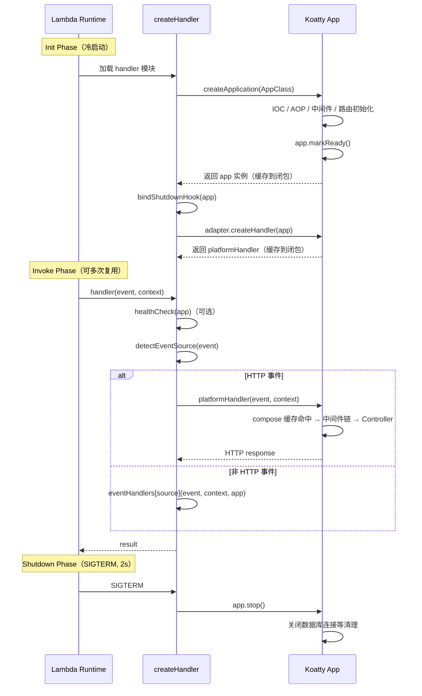

# Koatty Serverless 支持方案

> **状态**: 待实施  
> **日期**: 2026-02-13  
> **前置依赖**: [CALLBACK_REFACTORING_PLAN.md](./CALLBACK_REFACTORING_PLAN.md)（已完成）

---

## 一、背景

### 1.1 前置改造成果

[CALLBACK_REFACTORING_PLAN](./CALLBACK_REFACTORING_PLAN.md) 中的四项改造 **已全部完成并通过编译验证**：

| # | 改造项 | 涉及包 | 状态 |
|:-:|--------|--------|:----:|
| 1 | callback compose 缓存 | `koatty-core` | **已完成** |
| 2 | payload 中间件前移 | `koatty-router` | **已完成** |
| 3 | callback 接口 Koa 兼容重载 | `koatty-core` | **已完成** |
| 4 | Bootstrap 分离 + createApplication + getRequestHandler + Ready 状态 | `koatty-core` + `koatty` | **已完成** |

改造后框架已具备以下能力：

```typescript
import { createApplication } from 'koatty';

// 初始化应用但不启动服务器监听
const app = await createApplication(MyApp);

// 获取标准 (req, res) => Promise<any> 处理函数
const handler = app.getRequestHandler();

// app.isReady === true（Bootstrap 完成后自动标记）
```

### 1.2 设计原则

**koatty 框架本身只做 callback 方案改造，serverless 适配由独立的 `koatty-serverless` 包承担。**

- 框架核心零 serverless 概念侵入
- `koatty-serverless` 作为 monorepo 中的独立包，通过 `createApplication()` + `getRequestHandler()` 公共 API 与框架对接
- 用户可选择不安装 `koatty-serverless`，直接使用框架 API 手动集成（最简方式）

---

## 二、koatty-serverless 包设计

### 2.1 包结构

```
packages/koatty-serverless/
├── src/
│   ├── index.ts                    # 统一入口：createHandler + 类型导出
│   ├── types.ts                    # 公共类型定义
│   ├── handler.ts                  # createHandler 核心实现
│   ├── event-detector.ts           # 事件来源检测
│   ├── lifecycle.ts                # Serverless 生命周期管理（shutdown 等）
│   └── adapters/
│       ├── adapter.ts              # ServerlessAdapter 接口
│       ├── aws-lambda.ts           # AWS Lambda 适配器
│       ├── alicloud-fc.ts          # 阿里云函数计算适配器
│       └── tencent-scf.ts          # 腾讯云云函数适配器
├── test/
│   ├── handler.test.ts
│   ├── event-detector.test.ts
│   └── adapters/
│       ├── aws-lambda.test.ts
│       ├── alicloud-fc.test.ts
│       └── tencent-scf.test.ts
├── package.json
├── tsconfig.json
├── tsup.config.ts
├── api-extractor.json
└── README.md
```

### 2.2 package.json

```jsonc
{
  "name": "koatty_serverless",
  "version": "1.0.0",
  "description": "Serverless adapter for Koatty framework - deploy to AWS Lambda, Alibaba Cloud FC, Tencent SCF",
  "main": "./dist/index.js",
  "types": "./dist/index.d.ts",
  "exports": {
    ".": {
      "types": "./dist/index.d.ts",
      "import": "./dist/index.mjs",
      "require": "./dist/index.js"
    }
  },
  "scripts": {
    "build": "pnpm run build:js && pnpm run build:dts && pnpm run build:cp",
    "build:js": "tsup",
    "build:dts": "bash ../../scripts/build-dts.sh",
    "build:cp": "node ../../scripts/postBuild.js",
    "clean": "rimraf dist temp",
    "lint": "eslint --ext .ts,.js ./src",
    "test": "pnpm run lint && jest --passWithNoTests"
  },
  "dependencies": {
    "koatty_core": "workspace:*"
  },
  "peerDependencies": {
    "koatty": "^3.x",
    "koatty_core": "^1.x"
  },
  "optionalDependencies": {
    "@codegenie/serverless-express": "^4.x"
  },
  "devDependencies": {
    // 标准 monorepo 开发依赖 ...
  }
}
```

> **关键决策**：`@codegenie/serverless-express` 放在 `optionalDependencies`，仅 AWS Lambda 平台需要安装。
> 阿里云 FC HTTP 触发器无需任何额外依赖。

---

## 三、核心 API 设计

### 3.1 ServerlessAdapter 接口

```typescript
// src/adapters/adapter.ts
import type { KoattyApplication } from 'koatty_core';

/**
 * Serverless 平台适配器接口。
 * 每个云厂商实现此接口，负责将平台特定的事件/请求格式
 * 转换为 Koatty 可处理的标准 HTTP (req, res)。
 */
export interface ServerlessAdapter {
  /** 适配器名称（用于日志和调试） */
  readonly name: string;

  /**
   * 将已初始化的 Koatty app 包装为云厂商要求签名的 handler 函数。
   * @param app 已初始化的 Koatty 应用实例（app.isReady === true）
   * @returns 云厂商要求签名的 handler 函数
   */
  createHandler(app: KoattyApplication): (...args: any[]) => Promise<any>;
}
```

### 3.2 CreateHandlerOptions 配置

```typescript
// src/types.ts
import type { KoattyApplication } from 'koatty_core';
import type { ServerlessAdapter } from './adapters/adapter';

export type Platform = 'aws' | 'alicloud' | 'tencent';

export interface CreateHandlerOptions {
  /** 目标云平台，默认 'aws' */
  platform?: Platform;

  /** 自定义适配器（优先于 platform 参数） */
  adapter?: ServerlessAdapter;

  /** 自定义 bootFunc，在 app 初始化期间执行 */
  bootFunc?: (...args: any[]) => any;

  /**
   * 非 HTTP 事件处理器映射。
   * 当 Lambda/FC 入口不仅处理 HTTP 请求，还处理定时触发、消息队列等事件时，
   * 通过此映射将不同事件路由到对应的处理逻辑。
   */
  eventHandlers?: Record<string, EventHandler>;

  /**
   * 每次 Invoke 开始时执行的健康检查钩子。
   * 用于应对 Lambda 冻结/解冻后连接断开的场景。
   *
   * @example
   * ```typescript
   * healthCheck: async (app) => {
   *   const ds = IOC.get('TypeormStore')?.getDataSource();
   *   if (ds && !ds.isInitialized) await ds.initialize();
   * }
   * ```
   */
  healthCheck?: (app: KoattyApplication) => Promise<void>;
}

export type EventHandler = (
  event: any,
  context: any,
  app: KoattyApplication,
) => Promise<any>;
```

### 3.3 createHandler — 统一入口

```typescript
// src/handler.ts
import { createApplication } from 'koatty';
import type { KoattyApplication } from 'koatty_core';
import type { CreateHandlerOptions, Platform } from './types';
import type { ServerlessAdapter } from './adapters/adapter';
import { AwsLambdaAdapter } from './adapters/aws-lambda';
import { AliCloudFcAdapter } from './adapters/alicloud-fc';
import { TencentScfAdapter } from './adapters/tencent-scf';
import { detectEventSource } from './event-detector';
import { bindShutdownHook } from './lifecycle';

const adapterMap: Record<Platform, new () => ServerlessAdapter> = {
  aws: AwsLambdaAdapter,
  alicloud: AliCloudFcAdapter,
  tencent: TencentScfAdapter,
};

/**
 * 创建 Serverless Handler。
 *
 * 内部自动管理 app 实例缓存（单例），确保仅在冷启动时执行一次 bootstrap。
 * 后续 Invoke 复用同一个 app 实例和 handler 函数。
 *
 * @param AppClass - Koatty 应用类（必须继承自 Koatty）
 * @param options - 配置选项
 * @returns 云厂商要求签名的 handler 函数
 *
 * @example AWS Lambda
 * ```typescript
 * import { createHandler } from 'koatty_serverless';
 * import { App } from './App';
 * export const handler = createHandler(App, { platform: 'aws' });
 * ```
 *
 * @example 阿里云 FC
 * ```typescript
 * import { createHandler } from 'koatty_serverless';
 * import { App } from './App';
 * export const handler = createHandler(App, { platform: 'alicloud' });
 * ```
 */
export function createHandler(
  AppClass: any,
  options: CreateHandlerOptions = {},
) {
  const {
    platform = 'aws',
    adapter,
    bootFunc,
    eventHandlers,
    healthCheck,
  } = options;

  let cachedApp: KoattyApplication | null = null;
  let cachedHandler: ((...args: any[]) => Promise<any>) | null = null;

  return async (...args: any[]) => {
    // 1. 冷启动：初始化 app 实例（利用闭包缓存避免重复 bootstrap）
    if (!cachedApp) {
      cachedApp = await createApplication(AppClass, bootFunc);
      bindShutdownHook(cachedApp);
    }

    // 2. 连接健康检查（每次 Invoke 执行，应对冻结/解冻后连接断开）
    if (healthCheck) {
      await healthCheck(cachedApp);
    }

    // 3. 事件路由：检查是否为非 HTTP 事件
    if (eventHandlers && args.length >= 2) {
      const [event] = args;
      const eventSource = detectEventSource(event);
      if (eventSource && eventHandlers[eventSource]) {
        return eventHandlers[eventSource](event, args[1], cachedApp);
      }
    }

    // 4. HTTP 事件：使用平台适配器处理
    if (!cachedHandler) {
      const selectedAdapter = adapter || new adapterMap[platform]();
      cachedHandler = selectedAdapter.createHandler(cachedApp);
    }
    return cachedHandler(...args);
  };
}
```

### 3.4 事件来源检测

```typescript
// src/event-detector.ts

/**
 * 检测 Serverless 事件的来源类型。
 * 根据事件结构判断是 HTTP 请求还是其他事件（定时触发、消息队列等）。
 *
 * @returns 事件来源标识，null 表示 HTTP 请求（走适配器处理）
 */
export function detectEventSource(event: any): string | null {
  if (!event || typeof event !== 'object') return null;

  // AWS CloudWatch Events / EventBridge
  if (event.source === 'aws.events' || event['detail-type']) {
    return 'scheduled';
  }
  // 自定义定时触发
  if (event.source === 'serverless.timer' || event.triggerType === 'Timer') {
    return 'scheduled';
  }
  // AWS SQS
  if (event.Records?.[0]?.eventSource === 'aws:sqs') {
    return 'sqs';
  }
  // AWS SNS
  if (event.Records?.[0]?.EventSource === 'aws:sns') {
    return 'sns';
  }
  // AWS S3
  if (event.Records?.[0]?.eventSource === 'aws:s3') {
    return 's3';
  }
  // 阿里云定时触发器
  if (event.triggerName && event.triggerTime) {
    return 'scheduled';
  }
  // HTTP 事件（API Gateway v1/v2、FC HTTP 触发器）— 不走事件路由
  if (event.httpMethod || event.requestContext?.http || event.headers) {
    return null;
  }

  return event.triggerType || null;
}
```

### 3.5 Serverless 生命周期管理

```typescript
// src/lifecycle.ts
import type { KoattyApplication } from 'koatty_core';

let shutdownBound = false;

/**
 * 绑定 Serverless 关闭处理。
 *
 * Lambda/FC 在实例回收前发送 SIGTERM（最多 2 秒清理时间）。
 * 此函数确保在收到 SIGTERM 时触发 Koatty 的 appStop 事件链，
 * 执行数据库断连等清理操作。
 *
 * 注意：createApplication() 不调用 app.listen()，
 * 而 listen() 内部负责绑定 appStop 事件。
 * 因此 Serverless 模式下需要手动绑定。
 */
export function bindShutdownHook(app: KoattyApplication): void {
  if (shutdownBound) return;
  shutdownBound = true;

  const shutdown = async () => {
    try {
      app.stop?.();
    } catch (e) {
      console.error('[koatty-serverless] Shutdown error:', e);
    }
    process.exit(0);
  };

  process.on('SIGTERM', shutdown);
  process.on('SIGINT', shutdown);
}
```

---

## 四、平台适配器实现

### 4.1 AWS Lambda 适配器

```typescript
// src/adapters/aws-lambda.ts
import type { KoattyApplication } from 'koatty_core';
import type { ServerlessAdapter } from './adapter';

export class AwsLambdaAdapter implements ServerlessAdapter {
  readonly name = 'aws-lambda';
  private handler: any;

  createHandler(app: KoattyApplication) {
    // 延迟 require，仅在 AWS 平台时加载 serverless-express
    let serverlessExpress: any;
    try {
      serverlessExpress = require('@codegenie/serverless-express');
    } catch {
      throw new Error(
        '[koatty-serverless] AWS Lambda adapter requires "@codegenie/serverless-express". ' +
        'Install it: npm install @codegenie/serverless-express'
      );
    }

    // serverless-express 接受 app 对象，内部调用 app.callback()
    // Koatty 继承自 Koa，callback() 无参调用返回标准 (req, res) handler
    this.handler = serverlessExpress({ app: app as any });

    return async (event: any, context: any) => {
      // 避免 Lambda 等待 event loop 清空（数据库连接等会保持 loop 活跃）
      context.callbackWaitsForEmptyEventLoop = false;
      return this.handler(event, context);
    };
  }
}
```

> **兼容性说明**：`@codegenie/serverless-express` 的 `{ app }` 参数期望对象具有
> `callback()` 方法返回 `(req, res) => void`。Koatty 继承自 Koa，`callback()` 无参
> 调用已兼容（通过 Callback 改造的重载签名保证）。
>
> 若实际集成发现不兼容，使用备选方案：
> ```typescript
> const handler = app.getRequestHandler();
> const wrappedApp = { callback: () => handler };
> this.handler = serverlessExpress({ app: wrappedApp as any });
> ```

### 4.2 阿里云 FC 适配器

```typescript
// src/adapters/alicloud-fc.ts
import type { KoattyApplication } from 'koatty_core';
import type { ServerlessAdapter } from './adapter';

/**
 * 阿里云函数计算适配器。
 *
 * 阿里云 FC HTTP 触发器的入参已是标准 Node.js HTTP 对象 (IncomingMessage, ServerResponse)，
 * 因此可直接透传给 app.getRequestHandler()，无需事件转换。
 * 这是最轻量的适配器实现。
 */
export class AliCloudFcAdapter implements ServerlessAdapter {
  readonly name = 'alicloud-fc';

  createHandler(app: KoattyApplication) {
    const httpHandler = app.getRequestHandler();

    return async (req: any, resp: any, context?: any) => {
      // 将 FC context 挂载到 req 上，供业务代码读取
      if (context) {
        req.fcContext = context;
      }
      return httpHandler(req, resp);
    };
  }
}
```

### 4.3 腾讯云 SCF 适配器

```typescript
// src/adapters/tencent-scf.ts
import { IncomingMessage, ServerResponse } from 'http';
import { Socket } from 'net';
import type { KoattyApplication } from 'koatty_core';
import type { ServerlessAdapter } from './adapter';

/**
 * 腾讯云云函数 (SCF) 适配器。
 *
 * 腾讯云 SCF 通过 API Gateway 接收 HTTP 请求，入参为 JSON 事件对象，
 * 需要将其转换为模拟的 Node.js HTTP req/res 对。
 */
export class TencentScfAdapter implements ServerlessAdapter {
  readonly name = 'tencent-scf';

  createHandler(app: KoattyApplication) {
    const httpHandler = app.getRequestHandler();

    return async (event: any, context: any) => {
      const { req, res, promise } = createMockHttpPair(event);
      // 将 SCF context 挂载到 req
      (req as any).scfContext = context;
      httpHandler(req, res);
      return promise;
    };
  }
}

/**
 * 将腾讯云 API Gateway 事件转为模拟的 Node.js HTTP req/res 对。
 * 返回 promise 在 res.end() 时 resolve 为 API Gateway 响应格式。
 */
function createMockHttpPair(event: any): {
  req: IncomingMessage;
  res: ServerResponse;
  promise: Promise<any>;
} {
  const {
    httpMethod = 'GET',
    path = '/',
    headers = {},
    queryString = {},
    body,
    isBase64Encoded,
  } = event;

  // 构建 URL（含 query string）
  const qs = Object.entries(queryString)
    .map(([k, v]) => `${encodeURIComponent(k)}=${encodeURIComponent(String(v))}`)
    .join('&');
  const url = qs ? `${path}?${qs}` : path;

  // 创建模拟 socket 和 req
  const socket = new Socket();
  const req = new IncomingMessage(socket);
  req.method = httpMethod;
  req.url = url;
  req.headers = Object.fromEntries(
    Object.entries(headers).map(([k, v]) => [k.toLowerCase(), v])
  );

  // 写入 body
  if (body) {
    const bodyBuf = isBase64Encoded
      ? Buffer.from(body, 'base64')
      : Buffer.from(body);
    req.push(bodyBuf);
  }
  req.push(null); // EOF

  // 创建 res 并捕获输出
  const res = new ServerResponse(req);
  const chunks: Buffer[] = [];

  const promise = new Promise<any>((resolve) => {
    const originalWrite = res.write.bind(res);
    const originalEnd = res.end.bind(res);

    res.write = function (chunk: any, ...args: any[]) {
      if (chunk) chunks.push(Buffer.isBuffer(chunk) ? chunk : Buffer.from(chunk));
      return originalWrite(chunk, ...args);
    } as any;

    res.end = function (chunk?: any, ...args: any[]) {
      if (chunk) chunks.push(Buffer.isBuffer(chunk) ? chunk : Buffer.from(chunk));

      const responseBody = Buffer.concat(chunks).toString('utf8');
      const responseHeaders: Record<string, string> = {};
      const rawHeaders = res.getHeaders();
      for (const [key, val] of Object.entries(rawHeaders)) {
        responseHeaders[key] = String(val);
      }

      resolve({
        isBase64Encoded: false,
        statusCode: res.statusCode,
        headers: responseHeaders,
        body: responseBody,
      });

      return originalEnd(chunk, ...args);
    } as any;
  });

  return { req, res, promise };
}
```

---

## 五、统一导出

```typescript
// src/index.ts

// 核心 API
export { createHandler } from './handler';

// 类型
export type { CreateHandlerOptions, Platform, EventHandler } from './types';
export type { ServerlessAdapter } from './adapters/adapter';

// 适配器（用户可直接使用或扩展）
export { AwsLambdaAdapter } from './adapters/aws-lambda';
export { AliCloudFcAdapter } from './adapters/alicloud-fc';
export { TencentScfAdapter } from './adapters/tencent-scf';

// 工具
export { detectEventSource } from './event-detector';
```

---

## 六、用户使用示例

### 6.1 AWS Lambda（最常见场景）

```typescript
// src/lambda.ts
import { createHandler } from 'koatty_serverless';
import { App } from './App';

export const handler = createHandler(App, {
  platform: 'aws',
  healthCheck: async (app) => {
    // 检查数据库连接，Lambda 冻结/解冻后可能断开
    const ds = IOC.get('TypeormStore')?.getDataSource();
    if (ds && !ds.isInitialized) {
      await ds.initialize();
    }
  },
  eventHandlers: {
    // CloudWatch Events 定时触发 → 执行后台任务
    scheduled: async (event, context, app) => {
      const cronService = IOC.get('CronService');
      await cronService?.runScheduledTasks();
      return { statusCode: 200 };
    },
    // SQS 消息 → 异步处理
    sqs: async (event, context, app) => {
      for (const record of event.Records) {
        const body = JSON.parse(record.body);
        await IOC.get('MessageService')?.process(body);
      }
      return { statusCode: 200 };
    },
  },
});
```

### 6.2 阿里云函数计算

```typescript
// src/fc.ts
import { createHandler } from 'koatty_serverless';
import { App } from './App';

export const handler = createHandler(App, { platform: 'alicloud' });
```

### 6.3 腾讯云云函数

```typescript
// src/scf.ts
import { createHandler } from 'koatty_serverless';
import { App } from './App';

export const handler = createHandler(App, { platform: 'tencent' });
```

### 6.4 不使用 koatty-serverless（最简方式）

对于阿里云 FC HTTP 触发器等入参已是标准 HTTP 对象的平台，可直接使用框架 API：

```typescript
// src/handler.ts
import { createApplication } from 'koatty';
import { App } from './App';

let handler: (req: any, res: any) => Promise<any>;

export async function httpHandler(req: any, resp: any, context: any) {
  if (!handler) {
    const app = await createApplication(App);
    handler = app.getRequestHandler();
  }
  return handler(req, resp);
}
```

### 6.5 自定义适配器

```typescript
// 实现自定义适配器（如 Cloudflare Workers、Vercel Edge Functions）
import type { ServerlessAdapter } from 'koatty_serverless';
import type { KoattyApplication } from 'koatty_core';

class CloudflareAdapter implements ServerlessAdapter {
  readonly name = 'cloudflare-workers';

  createHandler(app: KoattyApplication) {
    const httpHandler = app.getRequestHandler();
    return async (request: Request) => {
      // 将 Cloudflare Request 转为 Node.js HTTP 格式 ...
    };
  }
}

// 使用
export const handler = createHandler(App, {
  adapter: new CloudflareAdapter(),
});
```

---

## 七、兼容性矩阵

### 7.1 特性支持

| 特性 | 传统部署 | Serverless (HTTP) | 说明 |
|------|:--------:|:-----------------:|------|
| HTTP Controller | 支持 | 支持 | |
| 中间件链 | 支持 | 支持 | compose 缓存加速 |
| AOP 切面 | 支持 | 支持 | |
| IOC 依赖注入 | 支持 | 支持 | |
| gRPC | 支持 | **不支持** | 长连接不适合 Serverless |
| WebSocket | 支持 | **不支持** | 需用 API Gateway WebSocket API |
| GraphQL | 支持 | 支持 | 走 HTTP 协议 |
| @Scheduled 定时任务 | 支持 | 改用事件路由 | `eventHandlers.scheduled` |
| TypeORM/数据库 | 支持 | 需适配 | healthCheck + RDS Proxy |
| OpenTelemetry | 支持 | 支持 | 需 Lambda 兼容 exporter |

### 7.2 各云厂商对照

| 维度 | AWS Lambda | 阿里云 FC | 腾讯云 SCF |
|------|-----------|-----------|-----------|
| 入口签名 | `(event, context) => Promise` | `(req, resp, context) => void` | `(event, context) => Promise` |
| HTTP 格式 | API Gateway 事件（需转换） | 标准 Node.js HTTP 对象 | API Gateway 事件（需转换） |
| 适配器实现 | `serverless-express` 转换 | **直接透传** | 手动构建 mock req/res |
| 额外依赖 | `@codegenie/serverless-express` | 无 | 无 |
| 非 HTTP 事件 | SQS/SNS/EventBridge | Timer/OSS | Timer/COS |
| Shutdown 信号 | SIGTERM (2s) | SIGTERM | SIGTERM |

---

## 八、冷启动优化

### 8.1 耗时分析

| 阶段 | 操作 | 预估耗时 | 优化空间 |
|------|------|----------|----------|
| 模块加载 | require/import 所有依赖 | 200-500ms | esbuild 单文件打包 |
| Loader.initialize | 路径、环境初始化 | <10ms | 无 |
| ComponentScan | 文件系统扫描 | 50-200ms | 显式组件注册 |
| IOC 注册 | 组件解析、依赖注入 | 50-100ms | 按需加载 |
| 中间件组装 | 构建中间件链 | <5ms | **已优化（compose 缓存）** |
| AOP 织入 | 切面代理 | 20-50ms | 无 |
| Server 创建 | loadServe 事件创建实例 | <10ms | 可选 NoopServer |
| 数据库连接 | TypeORM 初始化 | 200-1000ms | Lazy connect、RDS Proxy |
| **总计** | | **500-2000ms** | **目标 < 500ms** |

### 8.2 优化策略

| 策略 | 实现方式 | 预期效果 |
|------|----------|----------|
| App 实例缓存 | `createHandler` 内部闭包单例 | 仅冷启动执行一次 bootstrap |
| Handler 缓存 | `getRequestHandler()` compose 缓存 | 首次请求后零 compose 开销 |
| 单文件打包 | esbuild bundle → 减少文件 I/O | 减少 100-300ms |
| 显式组件注册 | `@Components` 装饰器或 bootFunc 注册 | 减少 50-200ms |
| 数据库 Lazy Connect | 首次查询时建立连接 | 减少 200-1000ms |
| Provisioned Concurrency | 云厂商预留实例/预留并发 | 消除冷启动 |

### 8.3 ComponentScan 打包兼容方案

> **关键风险**：使用 esbuild/webpack 打包为单文件后，文件系统中不再有
> `src/controller/*.ts` 等文件，`ComponentScan` 的 `fs.readdirSync` 将找不到组件。

**方案：显式组件注册模式**

```typescript
// 在 bootFunc 中手动注册组件，绕过文件系统扫描
const app = await createApplication(App, async (app) => {
  IOC.reg('UserController', UserController, { type: 'CONTROLLER' });
  IOC.reg('UserService', UserService, { type: 'SERVICE' });
});
```

或通过装饰器声明（未来增强）：

```typescript
@Components([UserController, UserService, AuthMiddleware])
export class App extends Koatty { ... }
```

### 8.4 可选优化：NoopServer

`createApplication()` 不调用 `listen()`，但 `LoadAllComponents` 过程中仍会触发
`loadServe` 事件创建真实服务器实例（未启动监听）。若希望跳过不必要的服务器创建：

```typescript
// config/server.ts — 用户配置
export default {
  serverless: true,  // 启用后创建 NoopServer 而非真实服务器
  protocol: 'http',
  port: 3000,
};
```

```typescript
// packages/koatty-serve/src/server/NoopServer.ts
import { KoattyServer, NativeServer } from 'koatty_core';

export class NoopServer implements KoattyServer {
  options: any = {};

  Start(_callback?: () => void): NativeServer {
    if (_callback) _callback();
    return null as any;
  }

  Stop(_callback?: () => void): void {
    if (_callback) _callback();
  }
}
```

> NoopServer 为**可选优化**，`createApplication()` 不依赖它即可正常工作。

---

## 九、Lambda 生命周期对齐



---

## 十、测试策略

### 10.1 单元测试

| 测试项 | 覆盖点 |
|--------|--------|
| `createHandler` | 初始化 app 并缓存、重复调用不重复 bootstrap |
| `detectEventSource` | HTTP/SQS/SNS/Scheduled/S3/未知事件 正确识别 |
| `AwsLambdaAdapter` | serverless-express 正确初始化、callbackWaitsForEmptyEventLoop |
| `AliCloudFcAdapter` | req/res 透传、fcContext 挂载 |
| `TencentScfAdapter` | 事件到 req/res 转换、响应格式正确 |
| `healthCheck` | 每次 Invoke 前执行、异常不阻断请求 |
| `bindShutdownHook` | SIGTERM 触发清理、仅绑定一次 |
| `eventHandlers` 路由 | 正确分发到对应 handler |

### 10.2 集成测试

```typescript
// test/integration/lambda.test.ts
import { createHandler } from '../src';

describe('Lambda Integration', () => {
  let handler: any;

  beforeAll(() => {
    handler = createHandler(TestApp, { platform: 'aws' });
  });

  it('should handle API Gateway v2 HTTP event', async () => {
    const event = {
      requestContext: { http: { method: 'GET', path: '/api/users' } },
      headers: { 'content-type': 'application/json' },
      body: null,
    };
    const result = await handler(event, {});
    expect(result.statusCode).toBe(200);
  });

  it('should route scheduled events', async () => {
    const scheduledHandler = createHandler(TestApp, {
      platform: 'aws',
      eventHandlers: {
        scheduled: async () => ({ ok: true }),
      },
    });
    const event = { source: 'aws.events', 'detail-type': 'Scheduled Event' };
    const result = await scheduledHandler(event, {});
    expect(result).toEqual({ ok: true });
  });

  it('should cache app across invocations', async () => {
    await handler({ httpMethod: 'GET', path: '/' }, {});
    await handler({ httpMethod: 'GET', path: '/' }, {});
    // bootstrap 只执行一次
  });
});
```

### 10.3 冷启动 Benchmark

```typescript
// test/benchmark/coldstart.ts
import { createApplication } from 'koatty';
import { App } from '../fixtures/App';

const start = process.hrtime.bigint();
const app = await createApplication(App);
const handler = app.getRequestHandler();
const elapsed = Number(process.hrtime.bigint() - start) / 1e6;

console.log(`Cold start: ${elapsed.toFixed(0)}ms`);
console.log(`  app.isReady: ${app.isReady}`);
assert(elapsed < 500, `Cold start exceeded 500ms: ${elapsed}ms`);
```

---

## 十一、实施步骤

| Phase | 内容 | 预估周期 | 依赖 |
|:-----:|------|:--------:|:----:|
| **0** | 框架 Callback 改造 | — | **已完成** |
| **1** | 创建 `koatty-serverless` 包骨架 + 接口定义 + 统一入口 | 2-3 天 | Phase 0 |
| **2** | 实现三个平台适配器 + 事件检测 + 生命周期管理 | 3-5 天 | Phase 1 |
| **3** | 单元测试 + 集成测试 | 2-3 天 | Phase 2 |
| **4** | 冷启动优化（显式组件注册、esbuild 打包配置） | 3-5 天 | Phase 3 |
| **5** | 文档 + 示例项目 + 迁移指南 | 2-3 天 | Phase 4 |

---

## 十二、风险与取舍

### 12.1 技术风险

| 风险 | 影响 | 缓解措施 |
|------|------|----------|
| `serverless-express` 与 Koatty callback 不兼容 | AWS 适配器不可用 | 预研验证；备选：`getRequestHandler()` 包装 |
| esbuild 打包后 ComponentScan 失败 | 应用无法启动 | 提供显式组件注册模式 |
| reflect-metadata 打包后丢失 | IOC/AOP 失效 | esbuild `keepNames: true` + emitDecoratorMetadata |
| Lambda 冻结后数据库连接断开 | 请求失败 | healthCheck + RDS Proxy |
| `loadServe` 创建不必要的服务器实例 | 轻微内存浪费 | 可选 NoopServer 优化 |

### 12.2 取舍决策

- **gRPC/WebSocket**：Serverless 下明确不支持，文档说明替代方案
- **NoopServer**：降级为可选优化，不阻塞核心功能
- **多云优先级**：AWS Lambda > 阿里云 FC > 腾讯云 SCF
- **`@codegenie/serverless-express`**：放在 optionalDependencies，仅 AWS 用户安装

---

## 附录：API 快速参考

### 框架层 API（已就绪）

```typescript
import { createApplication, ExecBootStrap } from 'koatty';

// Serverless：初始化但不监听
const app = await createApplication(MyApp, bootFunc?);
const handler = app.getRequestHandler('http');  // (req, res) => Promise
app.isReady;  // true

// 传统部署：初始化 + 监听（不变）
@ExecBootStrap()
class MyApp extends Koatty { ... }
```

### koatty-serverless API

```typescript
import { createHandler } from 'koatty_serverless';

// 一行创建 Serverless handler
export const handler = createHandler(MyApp, {
  platform: 'aws' | 'alicloud' | 'tencent',
  bootFunc?: Function,
  adapter?: ServerlessAdapter,          // 自定义适配器
  healthCheck?: (app) => Promise<void>, // 连接健康检查
  eventHandlers?: {                     // 非 HTTP 事件路由
    scheduled?: EventHandler,
    sqs?: EventHandler,
    sns?: EventHandler,
    [key: string]: EventHandler,
  },
});
```
