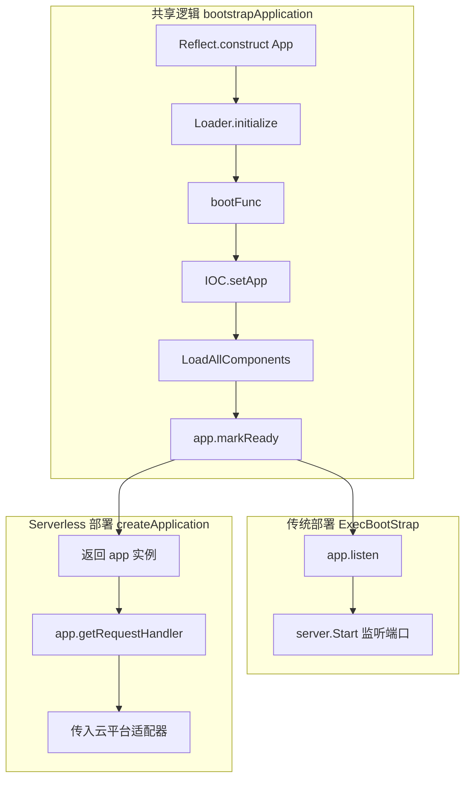
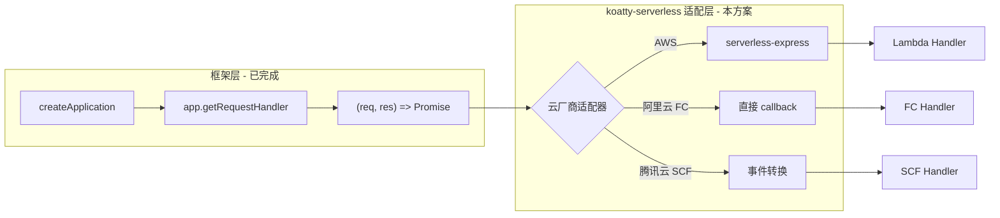
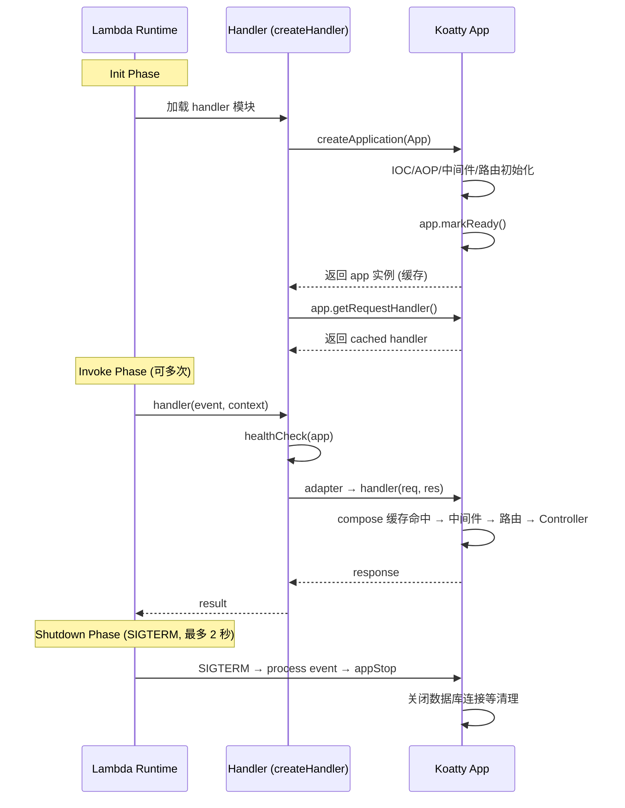

# Koatty 框架 Serverless 支持方案

> **状态**: 待评审  
> **日期**: 2026-02-13  
> **前置依赖**: [CALLBACK_REFACTORING_PLAN.md](./CALLBACK_REFACTORING_PLAN.md)（必须先完成）

---

## 一、架构分析总结

### 1.1 Koatty 核心架构

Koatty 基于 Koa 扩展，采用多协议架构（HTTP/gRPC/WebSocket/GraphQL），主要组件包括：

- **Bootstrap**: `packages/koatty/src/core/Bootstrap.ts` - `ExecBootStrap` 执行初始化、组件加载、最终调用 `app.listen()`
- **ServeComponent**: `packages/koatty-serve/src/ServeComponent.ts` - 在 `loadServe` 事件创建 HTTP/gRPC/WS 等服务器实例
- **Application.listen**: `packages/koatty-core/src/Application.ts` - 调用 `this.server.Start()` 启动监听
- **app.callback()**: 返回 `(req, res) => Promise` 标准 Node.js HTTP 请求处理器，与 Koa 兼容，**内置 compose 缓存**

### 1.2 前置改造成果（CALLBACK_REFACTORING_PLAN）

在实施本 Serverless 方案前，以下基础改造**已完成**：

| 改造项 | 内容 | 对 Serverless 的意义 |
|--------|------|---------------------|
| callback compose 缓存 | `callback()` 首次调用后缓存 handler，后续请求零 compose 开销 | Serverless 冷启动后首次请求更快，后续请求极低延迟 |
| payload 中间件前移 | payload 注册到路由之前，ctx.requestBody 等方法正确可用 | 确保 Serverless handler 处理请求时 body 解析正常 |
| callback 接口 Koa 兼容 | 重载签名兼容 Koa 标准 `callback()` 调用 | 兼容 `serverless-http`、`supertest` 等第三方库 |
| **Bootstrap 分离** | **新增 `createApplication()` 工厂函数 + `getRequestHandler()` 方法** | **Serverless 核心入口 —— 初始化但不监听** |
| **Ready 状态** | **新增 `app.isReady` 属性和 `app.markReady()` 方法** | **确保 handler 在初始化完成后才能使用** |

### 1.3 改造后的 Bootstrap 流程



### 1.4 关键方法签名（改造后）

```typescript
// 新增：仅初始化应用，不启动服务器（Serverless 入口）
export async function createApplication(
  target: any, bootFunc?: (...args: any[]) => any
): Promise<KoattyApplication>

// 新增：获取标准 HTTP handler（Serverless 使用）
app.getRequestHandler(protocol?: string): (req, res) => Promise<any>

// 已有（已优化：内置 compose 缓存）
app.callback(protocol?: string): (req, res) => Promise<any>

// 已有：传统启动
app.listen(listenCallback?: any): NativeServer
```

### 1.5 Serverless 与传统部署差异

| 维度 | 传统部署 | Serverless |
|------|----------|------------|
| 入口函数 | `ExecBootStrap()` → `app.listen(port)` | `createApplication()` → `app.getRequestHandler()` |
| 进程模型 | 常驻进程，持续监听 | 事件驱动，按需冷启动 |
| 请求处理 | 直接 `req/res` 入参 | API Gateway 事件需转换为 HTTP |
| 协议支持 | HTTP/gRPC/WS/GraphQL | 仅 HTTP（API Gateway） |
| 定时任务 | @Scheduled 常驻执行 | 需改为 EventBridge/CloudWatch 触发 |
| 生命周期 | 长期运行，graceful shutdown | Init → Invoke → Shutdown（最多 2 秒清理） |
| 连接管理 | 持久连接池 | 冻结/解冻导致连接断开，需 lazy reconnect |

### 1.6 各云厂商入口差异

| 云厂商 | 入口签名 | 事件格式 | HTTP 转换方式 |
|--------|----------|----------|---------------|
| AWS Lambda | `(event, context) => Promise` | API Gateway v1/v2 格式不同 | 需要 serverless-express 转换 |
| 阿里云 FC (HTTP 触发器) | `(req, resp, context) => void` | 原生 HTTP 对象 | 直接传入 `app.getRequestHandler()` |
| 腾讯云 SCF | `(event, context) => Promise` | API Gateway 事件 | 需要事件转换 |

---

## 二、设计方案

### 2.1 总体策略：适配器模式（基于已有基础设施）

由于 `createApplication()` 和 `getRequestHandler()` 已经提供了 **"初始化但不监听"** 的核心能力，
Serverless 支持方案只需在此基础上增加一个**适配层**，将云厂商的事件格式转换为标准 HTTP 请求。



**与之前方案的关键区别**：
- **不再需要** `bootstrapServerless()` 函数 —— 直接使用 `createApplication()`
- **不再需要** `app.serverlessMode` 标记 —— `createApplication()` 天然不调用 listen
- **不再需要修改** `executeBootstrap` —— 框架核心代码已在 callback 改造中完成
- **NoopServer 降级为可选优化**（见 2.3 节）

### 2.2 核心改造点

#### 2.2.1 框架层：零改动（已由 Callback 改造完成）

Callback 改造方案已提供以下能力：

```typescript
// packages/koatty/src/core/Bootstrap.ts - 已新增
export async function createApplication(target, bootFunc?): Promise<KoattyApplication>

// packages/koatty-core/src/Application.ts - 已新增
app.getRequestHandler(protocol?: string): (req, res) => Promise<any>
app.isReady: boolean
```

Serverless 方案**直接使用这些 API**，无需再改动框架核心代码。

#### 2.2.2 适配器接口设计

```typescript
// packages/koatty-serverless/src/adapter.ts

import type { KoattyApplication } from 'koatty_core';

/**
 * Serverless 平台适配器接口。
 * 每个云厂商实现此接口，将平台特定的事件格式转换为 Koatty 可处理的形式。
 */
export interface ServerlessAdapter {
  /** 适配器名称 */
  readonly name: string;

  /**
   * 将 app 包装为云厂商所需的 handler 函数。
   * @param app 已初始化的 Koatty 应用实例（isReady === true）
   * @returns 云厂商要求签名的 handler 函数
   */
  createHandler(app: KoattyApplication): (...args: any[]) => Promise<any>;
}
```

#### 2.2.3 AWS Lambda 适配器

```typescript
// packages/koatty-serverless/src/adapters/aws.ts
import serverlessExpress from '@codegenie/serverless-express';
import type { KoattyApplication } from 'koatty_core';
import type { ServerlessAdapter } from '../adapter';

export class AwsLambdaAdapter implements ServerlessAdapter {
  readonly name = 'aws-lambda';
  private handler: any;

  createHandler(app: KoattyApplication) {
    // 方案 A：直接传入 app（Koatty 继承自 Koa，callback() 已兼容）
    // serverless-express 内部调用 app.callback() 获取 handler
    this.handler = serverlessExpress({ app: app as any });

    return async (event: any, context: any) => {
      context.callbackWaitsForEmptyEventLoop = false;
      return this.handler(event, context);
    };
  }
}
```

> **关于 `serverless-express` 兼容性**：  
> `@codegenie/serverless-express` 的 `{ app }` 参数期望对象具有 `callback()` 方法返回 `(req, res) => void`。  
> Koatty 的 `callback()` 无参调用返回 `(req, res) => Promise`（已通过 Callback 改造支持重载签名）。  
> **需实际验证兼容性**。若不兼容，使用方案 B：
> ```typescript
> // 方案 B：直接使用 getRequestHandler() 绕过
> const handler = app.getRequestHandler();
> const wrappedApp = { callback: () => handler };
> this.handler = serverlessExpress({ app: wrappedApp as any });
> ```

#### 2.2.4 阿里云 FC 适配器

```typescript
// packages/koatty-serverless/src/adapters/alicloud.ts
import type { KoattyApplication } from 'koatty_core';
import type { ServerlessAdapter } from '../adapter';

export class AliCloudFcAdapter implements ServerlessAdapter {
  readonly name = 'alicloud-fc';

  createHandler(app: KoattyApplication) {
    // 直接使用 getRequestHandler()，阿里云 FC HTTP 触发器入参已是标准 req/res
    const httpHandler = app.getRequestHandler();

    return (req: any, resp: any, context: any) => {
      req.fcContext = context;
      return httpHandler(req, resp);
    };
  }
}
```

#### 2.2.5 腾讯云 SCF 适配器

```typescript
// packages/koatty-serverless/src/adapters/tencent.ts
import type { KoattyApplication } from 'koatty_core';
import type { ServerlessAdapter } from '../adapter';

export class TencentScfAdapter implements ServerlessAdapter {
  readonly name = 'tencent-scf';

  createHandler(app: KoattyApplication) {
    const httpHandler = app.getRequestHandler();

    return async (event: any, context: any) => {
      const { req, res, promise } = createMockHttpPair(event);
      httpHandler(req, res);
      return promise;
    };
  }
}

/**
 * 将腾讯云 API Gateway 事件转为模拟的 Node.js HTTP req/res 对。
 * 返回 promise 在 res.end() 时 resolve 为 API Gateway 响应格式。
 */
function createMockHttpPair(event: any) {
  // ... 实现事件到 IncomingMessage/ServerResponse 的映射
  // 参考 serverless-tencent 或 @vendia/serverless-express 的实现
}
```

#### 2.2.6 统一入口与事件路由

```typescript
// packages/koatty-serverless/src/index.ts
import { createApplication } from 'koatty';
import type { KoattyApplication } from 'koatty_core';
import type { ServerlessAdapter } from './adapter';
import { AwsLambdaAdapter } from './adapters/aws';
import { AliCloudFcAdapter } from './adapters/alicloud';
import { TencentScfAdapter } from './adapters/tencent';

export type Platform = 'aws' | 'alicloud' | 'tencent';

const adapterMap: Record<Platform, new () => ServerlessAdapter> = {
  aws: AwsLambdaAdapter,
  alicloud: AliCloudFcAdapter,
  tencent: TencentScfAdapter,
};

export interface CreateHandlerOptions {
  /** 云平台类型，默认 'aws' */
  platform?: Platform;
  /** 自定义适配器（优先于 platform） */
  adapter?: ServerlessAdapter;
  /** 自定义 bootFunc */
  bootFunc?: (...args: any[]) => any;
  /** 非 HTTP 事件处理器映射（用于定时触发、消息队列等） */
  eventHandlers?: Record<string, (event: any, context: any, app: KoattyApplication) => Promise<any>>;
  /** 连接健康检查钩子（每次 Invoke 开始时执行） */
  healthCheck?: (app: KoattyApplication) => Promise<void>;
}

let cachedApp: KoattyApplication | null = null;
let cachedHandler: ((...args: any[]) => Promise<any>) | null = null;

/**
 * 创建 Serverless Handler。
 *
 * @example AWS Lambda
 * ```typescript
 * import { createHandler } from 'koatty-serverless';
 * import { App } from './App';
 * export const handler = createHandler(App, { platform: 'aws' });
 * ```
 *
 * @example 阿里云 FC
 * ```typescript
 * import { createHandler } from 'koatty-serverless';
 * import { App } from './App';
 * export const handler = createHandler(App, { platform: 'alicloud' });
 * ```
 */
export function createHandler(
  AppClass: any,
  options: CreateHandlerOptions = {},
) {
  const { platform = 'aws', adapter, bootFunc, eventHandlers, healthCheck } = options;

  return async (...args: any[]) => {
    // 1. 初始化 app（利用全局缓存避免重复 bootstrap）
    if (!cachedApp) {
      cachedApp = await createApplication(AppClass, bootFunc);
    }

    // 2. 连接健康检查（应对 Lambda 冻结/解冻后连接断开）
    if (healthCheck) {
      await healthCheck(cachedApp);
    }

    // 3. 事件路由：检查是否为非 HTTP 事件（定时触发、消息队列等）
    if (eventHandlers && args.length >= 2) {
      const [event] = args;
      const eventSource = detectEventSource(event);
      if (eventSource && eventHandlers[eventSource]) {
        return eventHandlers[eventSource](event, args[1], cachedApp);
      }
    }

    // 4. HTTP 事件：使用平台适配器处理
    if (!cachedHandler) {
      const selectedAdapter = adapter || new adapterMap[platform]();
      cachedHandler = selectedAdapter.createHandler(cachedApp);
    }
    return cachedHandler(...args);
  };
}

/**
 * 检测事件来源类型。
 * 根据事件结构判断是 HTTP 请求还是其他事件（SQS、SNS、定时触发等）。
 */
function detectEventSource(event: any): string | null {
  if (event.source === 'aws.events' || event.source === 'serverless.timer') {
    return 'scheduled';
  }
  if (event.Records?.[0]?.eventSource === 'aws:sqs') {
    return 'sqs';
  }
  if (event.Records?.[0]?.EventSource === 'aws:sns') {
    return 'sns';
  }
  if (event.httpMethod || event.requestContext?.http) {
    return null; // HTTP 事件不走事件路由
  }
  return event.triggerType || null;
}

export { ServerlessAdapter } from './adapter';
export { AwsLambdaAdapter } from './adapters/aws';
export { AliCloudFcAdapter } from './adapters/alicloud';
export { TencentScfAdapter } from './adapters/tencent';
```

#### 2.2.7 用户入口示例

**AWS Lambda**：
```typescript
// src/lambda.ts
import { createHandler } from 'koatty-serverless';
import { App } from './App';

export const handler = createHandler(App, {
  platform: 'aws',
  healthCheck: async (app) => {
    // 检查数据库连接，断开则重连
    const ds = app.getService?.('TypeormStore')?.getDataSource();
    if (ds && !ds.isInitialized) {
      await ds.initialize();
    }
  },
  eventHandlers: {
    scheduled: async (event, context, app) => {
      const cronService = app.getService?.('CronService');
      await cronService?.runScheduledTasks();
      return { statusCode: 200 };
    },
  },
});
```

**阿里云 FC**：
```typescript
// src/fc.ts
import { createHandler } from 'koatty-serverless';
import { App } from './App';

export const handler = createHandler(App, { platform: 'alicloud' });
```

**不使用 koatty-serverless（最简方式）**：
```typescript
// src/handler.ts — 直接使用框架 API，无需额外适配包
import { createApplication } from 'koatty';
import { App } from './App';

let handler: (req: any, res: any) => Promise<any>;

// 阿里云 FC HTTP 触发器：入参已是标准 req/res
export async function httpHandler(req: any, resp: any, context: any) {
  if (!handler) {
    const app = await createApplication(App);
    handler = app.getRequestHandler();
  }
  return handler(req, resp);
}
```

### 2.3 可选优化：NoopServer 与 serverlessMode

> **注意**：以下优化**非必需**。`createApplication()` 已能正常工作，
> 但在 `LoadAllComponents` 过程中仍会触发 `loadServe` 事件创建真实服务器实例（未启动监听）。
> 若希望**跳过不必要的服务器创建**（尤其是 gRPC 等重量级协议），可实施以下优化。

#### 2.3.1 NoopServer

在 `packages/koatty-serve` 中引入空操作服务器：

```typescript
// packages/koatty-serve/src/server/NoopServer.ts
import { KoattyServer, NativeServer } from 'koatty_core';

/**
 * 空操作服务器 - Serverless 模式下使用。
 * 满足 KoattyServer 接口约束，但不执行任何实际操作。
 */
export class NoopServer implements KoattyServer {
  options: any = {};

  Start(_callback?: () => void): NativeServer {
    if (_callback) _callback();
    return null as any;
  }

  Stop(_callback?: () => void): void {
    if (_callback) _callback();
  }
}
```

#### 2.3.2 ServeComponent 条件加载

```typescript
// packages/koatty-serve/src/ServeComponent.ts
@OnEvent(AppEvent.loadServe)
async initServer(app: KoattyApplication): Promise<void> {
  // 检查配置中是否启用了 serverless 优化
  const serveOpts = app.config(undefined, 'server') || { protocol: "http" };

  if (serveOpts.serverless === true) {
    Logger.Log('Koatty', '', 'Serverless mode: using NoopServer (skip server creation)');
    Helper.define(app, 'server', new NoopServer());
    return;
  }

  // ... 现有服务器创建逻辑不变
}
```

用户在 `config/server.ts` 中配置即可启用：

```typescript
// config/server.ts
export default {
  serverless: true,  // 启用后 loadServe 创建 NoopServer 而非真实服务器
  protocol: 'http',
  port: 3000,
};
```

### 2.4 兼容性矩阵

| 特性 | 传统部署 | Serverless (HTTP) | 说明 |
|------|----------|-------------------|------|
| HTTP Controller | 支持 | 支持 | |
| 中间件 | 支持 | 支持 | compose 缓存加速 |
| AOP | 支持 | 支持 | |
| IOC/DI | 支持 | 支持 | |
| gRPC | 支持 | 不支持 | 长连接不适合 Serverless |
| WebSocket | 支持 | 不支持 | 需用 API Gateway WebSocket API |
| GraphQL | 支持 | 支持 | 走 HTTP 协议 |
| @Scheduled 定时任务 | 支持 | 改用事件路由 | 通过 `eventHandlers.scheduled` 处理 |
| TypeORM/数据库连接 | 支持 | 需适配 | 连接池 + RDS Proxy/Serverless DB |
| OpenTelemetry | 支持 | 支持 | 需 Lambda 兼容的 exporter |

---

## 三、冷启动优化与生命周期

### 3.1 冷启动耗时分析

Koatty 的 bootstrap 涉及以下阶段，需逐一评估耗时：

| 阶段 | 操作 | 预估耗时 | 优化空间 |
|------|------|----------|----------|
| 模块加载 | require/import 所有依赖 | 200-500ms | esbuild 打包减少文件数 |
| Loader.initialize | 路径、环境初始化 | <10ms | 无 |
| ComponentScan | **文件系统扫描** | 50-200ms | 显式注册替代扫描 |
| IOC 注册 | 组件解析、依赖注入 | 50-100ms | 按需加载 |
| 中间件组装 | 构建中间件链 | <5ms | **已优化（compose 缓存）** |
| AOP 织入 | 切面代理 | 20-50ms | 无 |
| Server 创建 | 创建但不监听 | <10ms | **可选优化（NoopServer）** |
| 数据库连接 | TypeORM 初始化 | 200-1000ms | Lazy connect、RDS Proxy |
| **总计** | | **500-2000ms** | 目标 < 500ms |

> **关键风险**：`ComponentScan` 依赖 `fs.readdirSync` 递归扫描 `src/` 目录。
> 当使用 esbuild/webpack 打包为单文件后，文件系统中不再有 `src/controller/*.ts` 等文件，
> 扫描将找不到任何组件，**导致应用无法正常启动**。

### 3.2 ComponentScan 打包兼容性方案

提供**显式组件注册模式**，绕过文件系统扫描：

```typescript
// 方案：在 App 类中通过装饰器显式声明所有组件
@Components([
  UserController,
  UserService,
  AuthMiddleware,
  // ... 显式列出所有组件
])
export class App extends Koatty {
  // ...
}
```

或在 `createApplication` 的 bootFunc 中手动注册：

```typescript
const app = await createApplication(App, async (app) => {
  // 显式注册组件，绕过 ComponentScan
  IOC.reg('UserController', UserController, { type: 'CONTROLLER' });
  IOC.reg('UserService', UserService, { type: 'SERVICE' });
});
```

在 `Loader.CheckAllComponents` 中增加分支：

```typescript
static CheckAllComponents(app: KoattyApplication, target: any) {
  if (Reflect.hasMetadata('COMPONENTS_LIST', target)) {
    // 显式注册模式：直接从元数据读取组件列表
    const components = Reflect.getMetadata('COMPONENTS_LIST', target);
    components.forEach(comp => IOC.reg(comp));
    return;
  }
  // ... 现有文件扫描逻辑
}
```

### 3.3 冷启动优化策略

| 策略 | 说明 | 预期效果 |
|------|------|----------|
| App 实例缓存 | `createHandler` 内部单例缓存，避免重复 bootstrap | 仅首次调用冷启动 |
| Handler 缓存 | `getRequestHandler()` 内部 compose 缓存 | 首次请求后零 compose 开销 |
| 模块预加载 | Handler 文件顶层 `import App`，利用 Lambda Init 阶段 | Init 期间完成模块加载 |
| 单文件打包 | esbuild bundle 为单文件，减少文件 I/O | 减少 100-300ms |
| 显式组件注册 | 绕过 `ComponentScan` 文件扫描 | 减少 50-200ms |
| NoopServer | 跳过服务器实例创建 | 减少 <10ms（HTTP），更多（gRPC） |
| 数据库 Lazy Connect | 首次查询时才建立连接 | 减少 200-1000ms |
| Provisioned Concurrency | AWS 预留并发 / FC 预留实例 | 消除冷启动 |
| 协议精简 | 打包时排除 gRPC/WS 相关代码 | 减少包体积和加载时间 |

### 3.4 Lambda 生命周期对齐



**Shutdown 处理**：

Koatty 现有的 `bindProcessEvent(this, 'appStop')` 已监听 SIGTERM 信号。
在 `createApplication()` 流程中，虽然没有调用 `listen()`（listen 内部注册 appStop），
但 `LoadAllComponents` 执行到 `loadServe` 时，`BaseServer` 构造函数中可能已通过 `CreateTerminus` 注册了关闭处理。

**建议**：在 `createApplication` 返回前，手动绑定 SIGTERM 处理：

```typescript
// 在 koatty-serverless/src/index.ts 的 createHandler 中
if (!cachedApp) {
  cachedApp = await createApplication(AppClass, bootFunc);

  // Serverless 关闭处理
  process.on('SIGTERM', async () => {
    try {
      await asyncEvent(cachedApp, AppEvent.appStop);
    } catch (e) {
      console.error('Serverless shutdown error:', e);
    }
    process.exit(0);
  });
}
```

---

## 四、插件与扩展适配

### 4.1 TypeORM 插件

| 问题 | 方案 |
|------|------|
| 冷启动时连接慢 | 支持 Lazy Connect：首次查询时才初始化 DataSource |
| 冻结后连接断开 | `healthCheck` 钩子中检测并重建连接 |
| 连接数超限 | 使用 RDS Proxy / PlanetScale / Neon 等 Serverless DB |
| 连接池配置 | Serverless 模式下 `extra: { max: 1 }` 限制连接数 |

HealthCheck 使用示例：

```typescript
export const handler = createHandler(App, {
  platform: 'aws',
  healthCheck: async (app) => {
    const ds = app.getService?.('TypeormStore')?.getDataSource();
    if (ds && !ds.isInitialized) {
      await ds.initialize();
    }
  },
});
```

### 4.2 Scheduled 插件

```typescript
// Serverless 模式下，ScheduledPlugin 可通过配置禁用内部定时器
// config/plugin.ts
export default {
  schedule: {
    enabled: process.env.KOATTY_SERVERLESS !== 'true',
  },
};
```

定时任务通过 `eventHandlers.scheduled` 路由到 Service 层，不依赖内建调度器。

### 4.3 Trace/Metrics

OpenTelemetry 可继续使用，需配置 Lambda 兼容的 exporter：

```typescript
// AWS Lambda: 使用 ADOT Lambda Layer 或 @opentelemetry/exporter-trace-otlp-http
// 阿里云 FC: 使用 ARMS 集成
```

---

## 五、实施步骤

### Phase 0：框架基础改造（前置依赖，已规划）

> 详见 [CALLBACK_REFACTORING_PLAN.md](./CALLBACK_REFACTORING_PLAN.md)

| # | 改造项 | 涉及包 | 状态 |
|:-:|--------|--------|:----:|
| 1 | callback compose 缓存 | `koatty-core` | 待实施 |
| 2 | payload 中间件前移 | `koatty-router` | 待实施 |
| 3 | callback 接口 Koa 兼容重载 | `koatty-core` | 待实施 |
| 4 | Bootstrap 分离 + createApplication + getRequestHandler + Ready 状态 | `koatty-core` + `koatty` | 待实施 |

**Phase 0 完成后，以下能力即可使用**：
```typescript
import { createApplication } from 'koatty';
const app = await createApplication(App);
const handler = app.getRequestHandler(); // (req, res) => Promise<any>
```

### Phase 1：koatty-serverless 适配包（1-2 周）

依赖：Phase 0 全部完成

1. **新建包**：`packages/koatty-serverless`，定义 `ServerlessAdapter` 接口
2. **AWS Lambda 适配器**：集成 `@codegenie/serverless-express`，验证 callback 兼容性
3. **阿里云 FC 适配器**：HTTP 触发器直接桥接
4. **腾讯云 SCF 适配器**：事件转换层
5. **统一入口**：`createHandler()` + 事件路由 + 健康检查钩子
6. **单元测试**：
   - `createHandler` 正确初始化 app 并缓存
   - `detectEventSource` 正确识别 HTTP/SQS/SNS/Scheduled 事件
   - 各平台适配器正确创建 handler
7. **集成测试**：
   - 模拟 API Gateway v1/v2 事件 → 验证 HTTP 请求路由到 Controller
   - 模拟定时触发事件 → 验证 `eventHandlers.scheduled` 正确执行
   - 模拟阿里云 FC HTTP 触发器 → 验证 req/res 透传

### Phase 2：冷启动优化（1 周）

8. **NoopServer**（可选）：在 `koatty-serve` 中实现，ServeComponent 通过配置判断
9. **显式组件注册**：`@Components` 装饰器或 bootFunc 手动注册
10. **esbuild 打包配置**：提供示例 `esbuild.config.ts`，单文件输出 + 外部化特定包
11. **冷启动 Benchmark**：
    - 建立基准测试：测量 bootstrap 各阶段耗时
    - 对比：文件扫描 vs 显式注册、打包前 vs 打包后
    - 目标：冷启动 < 500ms

### Phase 3：文档与示例（1 周）

12. **部署指南**：AWS Lambda (SAM/CDK/Serverless Framework)、阿里云 FC、腾讯云 SCF
13. **示例项目**：`packages/koatty/examples/serverless-aws/`，完整可运行的 Lambda 项目
14. **迁移指南**：现有 Koatty 项目如何增加 Serverless 部署入口
15. **限制说明**：明确 gRPC/WebSocket 不支持、@Scheduled 替代方案等

---

## 六、测试策略

### 6.1 单元测试

| 测试项 | 覆盖点 |
|--------|--------|
| `createApplication` | 返回 app、不调用 listen、app.isReady === true |
| `getRequestHandler` | 返回有效 handler、compose 缓存生效 |
| `createHandler` | app 初始化并缓存、事件路由正确 |
| `NoopServer` (可选) | Start/Stop 方法安全执行 |
| `detectEventSource` | 正确识别 HTTP/SQS/SNS/Scheduled 事件 |
| `AwsLambdaAdapter` | serverless-express 正确初始化 |
| `AliCloudFcAdapter` | req/res 正确透传 |
| `healthCheck` | 每次 Invoke 前正确执行 |

### 6.2 集成测试

使用 `@architect/sandbox` 或 `aws-lambda-rig` 本地模拟 Lambda 运行时：

```typescript
// test/integration/lambda.test.ts
import { createHandler } from 'koatty-serverless';
import { App } from '../fixtures/App';

describe('Lambda Integration', () => {
  let handler: any;

  beforeAll(() => {
    handler = createHandler(App, { platform: 'aws' });
  });

  it('should handle API Gateway v2 HTTP event', async () => {
    const event = {
      requestContext: { http: { method: 'GET', path: '/api/users' } },
      headers: { 'content-type': 'application/json' },
      body: null,
    };
    const result = await handler(event, {});
    expect(result.statusCode).toBe(200);
  });

  it('should route scheduled events', async () => {
    const scheduledHandler = createHandler(App, {
      platform: 'aws',
      eventHandlers: {
        scheduled: async () => ({ ok: true }),
      },
    });
    const event = { source: 'aws.events', detail: {} };
    const result = await scheduledHandler(event, {});
    expect(result).toEqual({ ok: true });
  });
});
```

### 6.3 冷启动 Benchmark

```typescript
// test/benchmark/coldstart.ts
import { createApplication } from 'koatty';
import { App } from '../fixtures/App';

const start = process.hrtime.bigint();
const app = await createApplication(App);
const handler = app.getRequestHandler();
const elapsed = Number(process.hrtime.bigint() - start) / 1e6;

console.log(`Cold start: ${elapsed.toFixed(0)}ms`);
console.log(`  app.isReady: ${app.isReady}`);
// 断言: elapsed < 500
```

### 6.4 E2E 测试（CI/CD 中可选）

- 部署到真实 AWS Lambda（通过 SAM/CDK）
- 发送 HTTP 请求验证响应
- 检查 CloudWatch Logs 中的冷启动耗时

---

## 七、依赖

| 依赖 | 用途 | 安装范围 |
|------|------|----------|
| `@codegenie/serverless-express` | AWS Lambda HTTP 事件转换 | koatty-serverless |
| `esbuild` | Serverless 打包（单文件输出） | devDependency |
| `@architect/sandbox` (可选) | 本地 Lambda 模拟测试 | devDependency |

> **注意**：`koatty` 框架本身无新增依赖。`createApplication()` 和 `getRequestHandler()`
> 均为框架内部代码，不引入任何外部包。

---

## 八、风险与取舍

### 8.1 技术风险

| 风险 | 影响 | 缓解措施 |
|------|------|----------|
| `serverless-express` 与 Koatty callback 不兼容 | AWS 适配器不可用 | 预研验证；备选方案：通过 `getRequestHandler()` 包装 |
| esbuild 打包后 ComponentScan 失败 | 应用无法启动 | 提供显式组件注册模式 |
| reflect-metadata 在打包后丢失 | IOC/AOP 失效 | esbuild 配置 `keepNames: true` + emitDecoratorMetadata |
| Lambda 冻结后数据库连接断开 | 请求失败 | healthCheck 钩子 + RDS Proxy |
| `loadServe` 创建不必要的服务器实例 | 轻微内存浪费 | 可选优化：NoopServer（Phase 2） |

### 8.2 取舍决策

- **gRPC/WebSocket**：Serverless 场景下明确不支持，文档中说明替代方案（API Gateway WebSocket API、gRPC-Web 转 HTTP）
- **有状态连接**：WebSocket 长连接、gRPC 流式不适合 Lambda，仅适合短连接 HTTP
- **NoopServer**：降级为可选优化，`createApplication()` 无需 NoopServer 即可工作
- **多云支持**：优先实现 AWS Lambda 适配器（生态最完善），阿里云/腾讯云可延后
- **IaC 模板**：提供 SAM/CDK 模板降低接入成本，Serverless Framework/Terraform 可社区贡献

### 8.3 与同构方案（ISOMORPHIC_APPLICATION_PLAN）的协调

| 交叉点 | 协调方式 |
|--------|----------|
| shared 包中引入 proto 生成代码 | Serverless 打包时通过 esbuild external 排除 gRPC 相关依赖 |
| DTO/验证规则共享 | shared 包保持环境无关，Serverless 可正常使用 |
| Schema 生成脚本 | CI 中先 codegen → 再 serverless build，保证类型一致 |
| 构建顺序 | shared → koatty-api (serverless build) → web，三者独立打包 |

---

## 附录：API 快速参考

### 框架层 API（Phase 0 提供）

```typescript
import { createApplication, ExecBootStrap } from 'koatty';

// Serverless：初始化但不监听
const app = await createApplication(MyApp, bootFunc?);
const handler = app.getRequestHandler('http');  // (req, res) => Promise
app.isReady;  // true

// 传统部署：初始化 + 监听（保持不变）
@ExecBootStrap()
class MyApp extends Koatty { ... }
```

### koatty-serverless API（Phase 1 提供）

```typescript
import { createHandler } from 'koatty-serverless';

// 一行创建 Serverless handler
export const handler = createHandler(MyApp, {
  platform: 'aws' | 'alicloud' | 'tencent',
  bootFunc?: Function,
  adapter?: ServerlessAdapter,         // 自定义适配器
  healthCheck?: (app) => Promise,      // 连接健康检查
  eventHandlers?: {                    // 非 HTTP 事件路由
    scheduled?: (event, context, app) => Promise,
    sqs?: (event, context, app) => Promise,
    sns?: (event, context, app) => Promise,
  },
});
```
