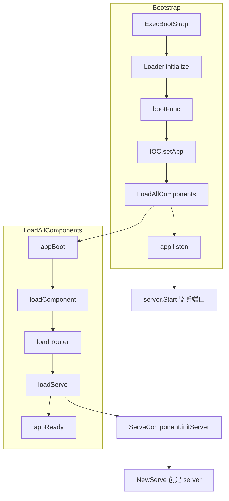
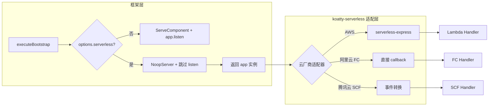
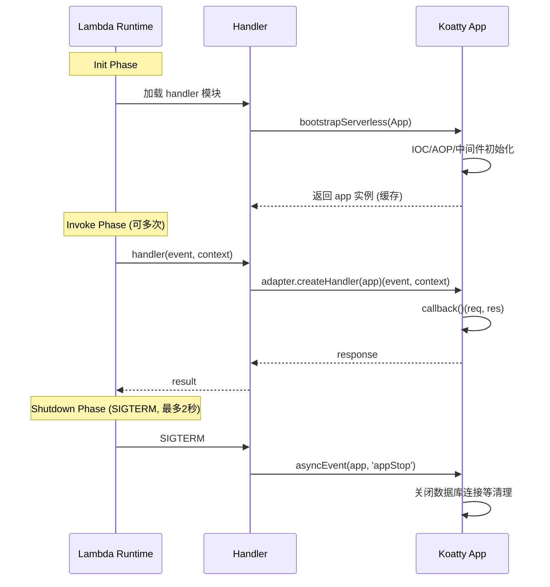

# Koatty 框架 Serverless 支持方案

## 一、架构分析总结

### 1.1 Koatty 核心架构

Koatty 基于 Koa 扩展，采用多协议架构（HTTP/gRPC/WebSocket/GraphQL），主要组件包括：

- **Bootstrap**: `packages/koatty/src/core/Bootstrap.ts` - `ExecBootStrap` 执行初始化、组件加载、最终调用 `app.listen()`
- **ServeComponent**: `packages/koatty-serve/src/ServeComponent.ts` - 在 `loadServe` 事件创建 HTTP/gRPC/WS 等服务器实例
- **Application.listen**: `packages/koatty-core/src/Application.ts` - 调用 `this.server.Start()` 启动监听
- **app.callback()**: 返回 `(req, res) => Promise` 标准 Node.js HTTP 请求处理器，与 Koa 兼容

### 1.2 Bootstrap 流程



### 1.3 关键方法签名

```typescript
// Application.callback() - 返回标准 Node.js HTTP handler
callback(protocol = "http", reqHandler?: (ctx: KoattyContext) => Promise<any>): (req: RequestType, res: ResponseType) => Promise<void>

// Application.listen() - 启动服务器
listen(listenCallback?: any): NativeServer

// ServeComponent.initServer() - 创建服务器实例
@OnEvent(AppEvent.loadServe)
async initServer(app: KoattyApplication): Promise<void>
```

### 1.4 Serverless 与传统部署差异

| 维度 | 传统部署 | Serverless |
|------|----------|------------|
| 进程模型 | 常驻进程，持续监听 | 事件驱动，按需冷启动 |
| 入口 | `app.listen(port)` | 导出 handler(event, context) |
| 请求处理 | 直接 `req/res` 入参 | API Gateway 事件需转换为 HTTP |
| 协议支持 | HTTP/gRPC/WS/GraphQL | 仅 HTTP（API Gateway） |
| 定时任务 | @Scheduled 常驻执行 | 需改为 EventBridge/CloudWatch 触发 |
| 生命周期 | 长期运行，graceful shutdown | Init → Invoke → Shutdown（最多2秒清理） |
| 连接管理 | 持久连接池 | 冻结/解冻导致连接断开，需 lazy reconnect |

### 1.5 各云厂商入口差异

| 云厂商 | 入口签名 | 事件格式 | HTTP 转换方式 |
|--------|----------|----------|---------------|
| AWS Lambda | `(event, context) => Promise` | API Gateway v1/v2 格式不同 | 需要 serverless-express 转换 |
| 阿里云 FC (HTTP 触发器) | `(req, resp, context) => void` | 原生 HTTP 对象 | 直接传入 `app.callback()` |
| 腾讯云 SCF | `(event, context) => Promise` | API Gateway 事件 | 需要事件转换 |

---

## 二、设计方案

### 2.1 总体策略：适配器模式 + 应用级模式标记

采用**适配器模式**在框架层增加 Serverless 运行时分支，通过 `app.options.serverless` 作为**唯一模式标记**，所有组件读取此标记判断行为，不依赖环境变量散落各处。



### 2.2 核心改造点

#### 2.2.1 Bootstrap 改造：分离装饰器与工厂函数

**问题**：`ExecBootStrap` 是类装饰器，在 Serverless 场景中需要以普通函数方式调用获取 app 实例。将装饰器当函数调用语义不清晰。

**方案**：在 `packages/koatty/src/core/Bootstrap.ts` 中分离两种用法：

```typescript
// ============ 接口定义 ============

interface BootstrapOptions {
  /** 是否为 Serverless 模式 */
  serverless?: boolean;
  /** 要跳过的协议（serverless 模式下自动跳过 gRPC/WS） */
  skipProtocols?: string[];
}

// ============ 1. 装饰器（传统部署，保持现有用法不变）============

export function ExecBootStrap(bootFunc?: (...args: any[]) => any) {
  return async (target: any) => {
    if (!(target.prototype instanceof Koatty)) {
      throw new Error(`class ${target.name} does not inherit from Koatty`);
    }
    return await executeBootstrap(target, bootFunc, true, { serverless: false });
  };
}

// ============ 2. 工厂函数（Serverless 部署，非装饰器）============

/**
 * Serverless 模式下初始化 Koatty 应用，不启动端口监听。
 * 返回已完成 IOC/AOP/中间件加载的 app 实例，可直接调用 app.callback()。
 * 
 * @example
 * const app = await bootstrapServerless(App, myBootFunc);
 * const handler = app.callback('http');
 */
export async function bootstrapServerless(
  target: any,
  bootFunc?: (...args: any[]) => any,
): Promise<KoattyApplication> {
  if (!(target.prototype instanceof Koatty)) {
    throw new Error(`class ${target.name} does not inherit from Koatty`);
  }
  return await executeBootstrap(target, bootFunc, true, { serverless: true });
}
```

修改 `executeBootstrap` 内部逻辑：

```typescript
const executeBootstrap = async function (
  target: any,
  bootFunc?: (...args: any[]) => any,
  isInitiative = false,
  options: BootstrapOptions = {},
): Promise<KoattyApplication> {
  checkRuntime();
  const isUTRuntime = checkUTRuntime();
  if (!isInitiative && isUTRuntime) return;

  const app = <KoattyApplication>Reflect.construct(target, []);

  // ====== 关键：将 serverless 模式写入 app 级标记 ======
  Helper.define(app, 'serverlessMode', !!options.serverless);

  if (!app.silent) console.log(LOGO);
  Loader.initialize(app);

  if (Helper.isFunction(bootFunc)) {
    Logger.Log('Koatty', '', 'Execute bootFunc ...');
    await bootFunc(app);
  }

  IOC.setApp(app);
  Logger.Log('Koatty', '', 'ComponentScan ...');
  Loader.CheckAllComponents(app, target);
  await Loader.LoadAllComponents(app, target);

  if (options.serverless) {
    // Serverless 模式：不调用 listen，直接触发 appStart
    Logger.Log('Koatty', '', 'Serverless mode: app initialized without listen');
    await asyncEvent(app, AppEvent.appStart);
  } else if (!isUTRuntime) {
    app.listen(listenCallback);
  }

  return app;
};
```

#### 2.2.2 NoopServer：替代 `server = null`

**问题**：将 `app.server` 赋值为 `null` 会导致所有读取 `app.server` 的代码（`listen()`、terminus、插件等）crash。

**方案**：在 `packages/koatty-serve` 中引入 `NoopServer`，实现 `IServer` 接口：

```typescript
// packages/koatty-serve/src/server/NoopServer.ts
import { IServer } from '../IServer';

/**
 * 空操作服务器 - Serverless 模式下使用。
 * 满足所有 IServer 接口约束，但不执行任何实际操作。
 */
export class NoopServer implements IServer {
  readonly status = 'serverless';
  readonly protocol = 'http';

  Start(callback?: Function): any {
    // Serverless 模式下不需要启动监听
    if (callback) callback();
    return null;
  }

  Stop(): Promise<void> {
    // 无需关闭
    return Promise.resolve();
  }

  GetServer(): any {
    return null;
  }
}
```

#### 2.2.3 ServeComponent 条件加载

在 `packages/koatty-serve/src/ServeComponent.ts` 中，通过 `app.serverlessMode` 标记判断（**不直接读 `process.env`**）：

```typescript
@OnEvent(AppEvent.loadServe)
async initServer(app: KoattyApplication): Promise<void> {
  // ====== 统一通过 app 级标记判断 ======
  if (app.serverlessMode) {
    Logger.Log('Koatty', '', 'Serverless mode: using NoopServer');
    Helper.define(app, 'server', new NoopServer());
    return;
  }

  // ... 现有逻辑不变
  const serveOpts = app.config(undefined, 'server') || { protocol: "http" };
  // ...
}
```

`Application.listen()` 无需特殊防护——`NoopServer.Start()` 会正常执行空操作。
但仍建议增加防御性检查作为安全网：

```typescript
listen(listenCallback?: any) {
  if (!this.server) {
    Logger.Warn('No server instance, skipping listen');
    return;
  }
  // ... 现有逻辑
}
```

#### 2.2.4 KoattyApplication 类型扩展

```typescript
// packages/koatty-core/src/IApplication.ts
export interface KoattyApplication extends Koa {
  // ... 现有定义 ...

  /** 是否为 Serverless 运行模式 */
  readonly serverlessMode: boolean;
}
```

---

### 2.3 `koatty-serverless` 适配包

新建 `packages/koatty-serverless`，提供多云适配器和 Handler 工厂。

#### 2.3.1 适配器接口

```typescript
// packages/koatty-serverless/src/adapter.ts

/**
 * Serverless 平台适配器接口。
 * 每个云厂商实现此接口，将平台特定的事件格式转换为 Koatty 可处理的形式。
 */
export interface ServerlessAdapter {
  /** 适配器名称 */
  readonly name: string;
  
  /**
   * 将 app 包装为云厂商所需的 handler 函数。
   * @param app 已初始化的 Koatty 应用实例
   * @returns 云厂商要求签名的 handler 函数
   */
  createHandler(app: KoattyApplication): (...args: any[]) => Promise<any>;
}
```

#### 2.3.2 AWS Lambda 适配器

```typescript
// packages/koatty-serverless/src/adapters/aws.ts
import serverlessExpress from '@codegenie/serverless-express';
import type { KoattyApplication } from 'koatty-core';
import type { ServerlessAdapter } from '../adapter';

export class AwsLambdaAdapter implements ServerlessAdapter {
  readonly name = 'aws-lambda';
  private handler: any;

  createHandler(app: KoattyApplication) {
    // serverless-express 接受 Koa 兼容的 app 对象
    // Koatty 继承自 Koa，原生 callback() 方法兼容
    // 注意：此处传 app 实例，serverless-express 内部调用 app.callback()
    this.handler = serverlessExpress({ app: app as any });

    return async (event: any, context: any) => {
      // Lambda 最佳实践：不等待事件循环排空
      context.callbackWaitsForEmptyEventLoop = false;
      return this.handler(event, context);
    };
  }
}
```

> **关于 `serverless-express` 与 Koatty 兼容性**：  
> `@codegenie/serverless-express` 的 `{ app }` 参数期望对象具有 `callback()` 方法返回 `(req, res) => void`。  
> Koatty 的 `callback(protocol)` 方法签名为 `callback(protocol = "http")` 返回 `(req, res) => Promise`。  
> 无参调用 `app.callback()` 等价于 `app.callback("http")`，返回值兼容。  
> **但需实际验证** `serverless-express` 是否能正确处理返回 Promise 的 callback。若不兼容，需包装适配层：
> ```typescript
> const wrappedApp = { callback: () => (req, res) => { app.callback('http')(req, res); } };
> this.handler = serverlessExpress({ app: wrappedApp });
> ```

#### 2.3.3 阿里云 FC 适配器

```typescript
// packages/koatty-serverless/src/adapters/alicloud.ts
import type { KoattyApplication } from 'koatty-core';
import type { ServerlessAdapter } from '../adapter';

export class AliCloudFcAdapter implements ServerlessAdapter {
  readonly name = 'alicloud-fc';

  createHandler(app: KoattyApplication) {
    const httpHandler = app.callback('http');

    // 阿里云 FC HTTP 触发器：入参已经是标准 req/res
    // 无需事件转换，直接传入 Koatty callback
    return (req: any, resp: any, context: any) => {
      // 将 FC context 注入 req 供中间件使用
      req.fcContext = context;
      return httpHandler(req, resp);
    };
  }
}
```

#### 2.3.4 腾讯云 SCF 适配器

```typescript
// packages/koatty-serverless/src/adapters/tencent.ts
import type { KoattyApplication } from 'koatty-core';
import type { ServerlessAdapter } from '../adapter';
import { createServer, IncomingMessage, ServerResponse } from 'http';

export class TencentScfAdapter implements ServerlessAdapter {
  readonly name = 'tencent-scf';

  createHandler(app: KoattyApplication) {
    const httpHandler = app.callback('http');

    return async (event: any, context: any) => {
      // 将 API Gateway 事件转换为 Node.js req/res
      const { req, res, promise } = createMockHttpPair(event);
      httpHandler(req, res);
      return promise;
    };
  }
}

/**
 * 将腾讯云 API Gateway 事件转为模拟的 Node.js HTTP req/res 对。
 * 返回 promise 在 res.end() 时 resolve 为 API Gateway 响应格式。
 */
function createMockHttpPair(event: any) {
  // ... 实现事件到 IncomingMessage/ServerResponse 的映射
  // 参考 serverless-tencent 或 @vendia/serverless-express 的实现
}
```

#### 2.3.5 统一入口与事件路由

```typescript
// packages/koatty-serverless/src/index.ts
import { bootstrapServerless } from 'koatty';
import type { KoattyApplication } from 'koatty-core';
import type { ServerlessAdapter } from './adapter';
import { AwsLambdaAdapter } from './adapters/aws';
import { AliCloudFcAdapter } from './adapters/alicloud';
import { TencentScfAdapter } from './adapters/tencent';

export type Platform = 'aws' | 'alicloud' | 'tencent';

// 预置适配器映射
const adapterMap: Record<Platform, new () => ServerlessAdapter> = {
  aws: AwsLambdaAdapter,
  alicloud: AliCloudFcAdapter,
  tencent: TencentScfAdapter,
};

export interface CreateHandlerOptions {
  /** 云平台类型，默认 'aws' */
  platform?: Platform;
  /** 自定义适配器（优先于 platform） */
  adapter?: ServerlessAdapter;
  /** 自定义 bootFunc */
  bootFunc?: (...args: any[]) => any;
  /** 非 HTTP 事件处理器映射（用于定时触发、消息队列等） */
  eventHandlers?: Record<string, (event: any, context: any, app: KoattyApplication) => Promise<any>>;
}

let cachedApp: KoattyApplication | null = null;
let cachedHandler: ((...args: any[]) => Promise<any>) | null = null;

/**
 * 创建 Serverless Handler。
 * 
 * @example AWS Lambda
 * ```typescript
 * import { createHandler } from 'koatty-serverless';
 * import { App } from './App';
 * export const handler = createHandler(App, { platform: 'aws' });
 * ```
 * 
 * @example 阿里云 FC
 * ```typescript
 * import { createHandler } from 'koatty-serverless';
 * import { App } from './App';
 * export const handler = createHandler(App, { platform: 'alicloud' });
 * ```
 */
export function createHandler(
  AppClass: any,
  options: CreateHandlerOptions = {},
) {
  const { platform = 'aws', adapter, bootFunc, eventHandlers } = options;

  return async (...args: any[]) => {
    // 1. 初始化 app（利用全局缓存避免重复 bootstrap）
    if (!cachedApp) {
      cachedApp = await bootstrapServerless(AppClass, bootFunc);
    }

    // 2. 事件路由：检查是否为非 HTTP 事件（定时触发、消息队列等）
    if (eventHandlers && args.length >= 2) {
      const [event] = args;
      const eventSource = detectEventSource(event);
      if (eventSource && eventHandlers[eventSource]) {
        return eventHandlers[eventSource](event, args[1], cachedApp);
      }
    }

    // 3. HTTP 事件：使用平台适配器处理
    if (!cachedHandler) {
      const selectedAdapter = adapter || new adapterMap[platform]();
      cachedHandler = selectedAdapter.createHandler(cachedApp);
    }
    return cachedHandler(...args);
  };
}

/**
 * 检测事件来源类型。
 * 根据事件结构判断是 HTTP 请求还是其他事件（SQS、SNS、定时触发等）。
 */
function detectEventSource(event: any): string | null {
  if (event.source === 'aws.events' || event.source === 'serverless.timer') {
    return 'scheduled';
  }
  if (event.Records?.[0]?.eventSource === 'aws:sqs') {
    return 'sqs';
  }
  if (event.Records?.[0]?.EventSource === 'aws:sns') {
    return 'sns';
  }
  // HTTP 事件（API Gateway v1/v2）不走事件路由
  if (event.httpMethod || event.requestContext?.http) {
    return null;
  }
  return event.triggerType || null;
}

export { ServerlessAdapter } from './adapter';
export { AwsLambdaAdapter } from './adapters/aws';
export { AliCloudFcAdapter } from './adapters/alicloud';
export { TencentScfAdapter } from './adapters/tencent';
```

#### 2.3.6 用户入口示例

**AWS Lambda**：
```typescript
// src/lambda.ts
import { createHandler } from 'koatty-serverless';
import { App } from './App';

export const handler = createHandler(App, {
  platform: 'aws',
  eventHandlers: {
    // 定时任务：EventBridge 触发，调用 Service 层
    scheduled: async (event, context, app) => {
      const cronService = app.getService('CronService');
      await cronService.runScheduledTasks();
      return { statusCode: 200 };
    },
  },
});
```

**阿里云 FC**：
```typescript
// src/fc.ts
import { createHandler } from 'koatty-serverless';
import { App } from './App';

export const handler = createHandler(App, { platform: 'alicloud' });
```

---

### 2.4 兼容性矩阵

| 特性 | 传统部署 | Serverless (HTTP) | 说明 |
|------|----------|-------------------|------|
| HTTP Controller | 支持 | 支持 | |
| 中间件 | 支持 | 支持 | |
| AOP | 支持 | 支持 | |
| IOC/DI | 支持 | 支持 | |
| gRPC | 支持 | 不支持 | 长连接不适合 Serverless |
| WebSocket | 支持 | 不支持 | 需用 API Gateway WebSocket API |
| GraphQL | 支持 | 支持 | 走 HTTP 协议 |
| @Scheduled 定时任务 | 支持 | 改用事件路由 | 通过 `eventHandlers.scheduled` 处理 |
| TypeORM/数据库连接 | 支持 | 需适配 | 连接池 + RDS Proxy/Serverless DB |
| OpenTelemetry | 支持 | 支持 | 需 Lambda 兼容的 exporter |

---

## 三、冷启动优化与生命周期

### 3.1 冷启动耗时分析

Koatty 的 bootstrap 涉及以下阶段，需逐一评估耗时：

| 阶段 | 操作 | 预估耗时 | 优化空间 |
|------|------|----------|----------|
| 模块加载 | require/import 所有依赖 | 200-500ms | esbuild 打包减少文件数 |
| Loader.initialize | 路径、环境初始化 | <10ms | 无 |
| ComponentScan | **文件系统扫描** | 50-200ms | 显式注册替代扫描 |
| IOC 注册 | 组件解析、依赖注入 | 50-100ms | 按需加载 |
| 中间件组装 | 构建中间件链 | <20ms | 无 |
| AOP 织入 | 切面代理 | 20-50ms | 无 |
| 数据库连接 | TypeORM 初始化 | 200-1000ms | Lazy connect、RDS Proxy |
| **总计** | | **500-2000ms** | 目标 < 500ms |

> **关键风险**：`ComponentScan` 依赖 `fs.readdirSync` 递归扫描 `src/` 目录。  
> 当使用 esbuild/webpack 打包为单文件后，文件系统中不再有 `src/controller/*.ts` 等文件，
> 扫描将找不到任何组件，**导致应用无法正常启动**。

### 3.2 ComponentScan 打包兼容性方案

提供**显式组件注册模式**，绕过文件系统扫描：

```typescript
// 方案：在 App 类中通过装饰器显式声明所有组件
@ExecBootStrap()  // 或 bootstrapServerless
@Components([
  UserController,
  UserService,
  AuthMiddleware,
  // ... 显式列出所有组件
])
export class App extends Koatty {
  // ...
}
```

或在 `bootstrapServerless` 中支持组件列表参数：

```typescript
export async function bootstrapServerless(
  target: any,
  bootFunc?: (...args: any[]) => any,
  options?: {
    /** 显式组件列表，跳过 ComponentScan */
    components?: any[];
  },
): Promise<KoattyApplication> {
  // ...
}
```

在 `Loader.CheckAllComponents` 中增加分支：

```typescript
static CheckAllComponents(app: KoattyApplication, target: any) {
  if (app.serverlessMode && Reflect.hasMetadata('COMPONENTS_LIST', target)) {
    // 显式注册模式：直接从元数据读取组件列表
    const components = Reflect.getMetadata('COMPONENTS_LIST', target);
    components.forEach(comp => IOC.reg(comp));
    return;
  }
  // ... 现有文件扫描逻辑
}
```

### 3.3 冷启动优化策略

| 策略 | 说明 | 预期效果 |
|------|------|----------|
| App 实例缓存 | 全局 `cachedApp` 单例，避免重复 bootstrap | 仅首次调用冷启动 |
| 模块预加载 | Handler 文件顶层 `import App`，利用 Lambda Init 阶段 | Init 期间完成模块加载 |
| 单文件打包 | esbuild bundle 为单文件，减少文件 I/O | 减少 100-300ms |
| 显式组件注册 | 绕过 `ComponentScan` 文件扫描 | 减少 50-200ms |
| 数据库 Lazy Connect | 首次查询时才建立连接 | 减少 200-1000ms |
| Provisioned Concurrency | AWS 预留并发 / FC 预留实例 | 消除冷启动 |
| 协议精简 | 打包时排除 gRPC/WS 相关代码 | 减少包体积和加载时间 |

### 3.4 Lambda 生命周期对齐



**Shutdown 处理**：

修改 `executeBootstrap` 中的进程事件绑定：

```typescript
if (options.serverless) {
  // Serverless 模式：监听 SIGTERM 做轻量清理，不依赖 terminus
  process.on('SIGTERM', async () => {
    Logger.Log('Koatty', '', 'Serverless shutdown: cleaning up...');
    try {
      await asyncEvent(app, AppEvent.appStop);
    } catch (e) {
      Logger.Error(e);
    }
    process.exit(0);
  });
} else {
  // 传统模式：保持现有 terminus + bindProcessEvent 逻辑
  app.listen(listenCallback);
}
```

**冻结/解冻处理**：

在 `koatty-serverless` 中提供连接健康检查钩子：

```typescript
// 在每次 Invoke 开始时检查关键连接是否存活
export function createHandler(AppClass: any, options: CreateHandlerOptions = {}) {
  return async (...args: any[]) => {
    if (!cachedApp) {
      cachedApp = await bootstrapServerless(AppClass, options.bootFunc);
    }

    // 解冻后检查连接健康状态
    if (options.healthCheck) {
      await options.healthCheck(cachedApp);
    }

    // ... 事件路由与 HTTP 处理
  };
}
```

用户使用示例：

```typescript
export const handler = createHandler(App, {
  platform: 'aws',
  healthCheck: async (app) => {
    // 检查数据库连接，断开则重连
    const ds = app.getService('TypeormStore')?.getDataSource();
    if (ds && !ds.isInitialized) {
      await ds.initialize();
    }
  },
});
```

---

## 四、插件与扩展适配

### 4.1 TypeORM 插件

| 问题 | 方案 |
|------|------|
| 冷启动时连接慢 | 支持 Lazy Connect：首次查询时才初始化 DataSource |
| 冻结后连接断开 | `healthCheck` 钩子中检测并重建连接 |
| 连接数超限 | 使用 RDS Proxy / PlanetScale / Neon 等 Serverless DB |
| 连接池配置 | Serverless 模式下 `extra: { max: 1 }` 限制连接数 |

### 4.2 Scheduled 插件

```typescript
// Serverless 模式下，ScheduledPlugin 不启动内部定时器
@OnEvent(AppEvent.appReady)
async onReady(app: KoattyApplication): Promise<void> {
  if (app.serverlessMode) {
    Logger.Log('Koatty', '', 'Serverless mode: @Scheduled disabled, use cloud triggers');
    return;
  }
  // ... 现有定时器启动逻辑
}
```

定时任务通过 `eventHandlers.scheduled` 路由到 Service 层，不依赖内建调度器。

### 4.3 Trace/Metrics

OpenTelemetry 可继续使用，需配置 Lambda 兼容的 exporter：

```typescript
// AWS Lambda: 使用 ADOT Lambda Layer 或 @opentelemetry/exporter-trace-otlp-http
// 阿里云 FC: 使用 ARMS 集成
```

---

## 五、实施步骤

### Phase 1：框架核心改造（1-2 周）

1. **类型扩展**：在 `KoattyApplication` 接口增加 `serverlessMode: boolean`
2. **Bootstrap 改造**：
   - `executeBootstrap` 增加 `BootstrapOptions` 参数
   - 新增 `bootstrapServerless()` 工厂函数
   - `serverless: true` 时写入 `app.serverlessMode`，跳过 `app.listen()`
3. **NoopServer**：在 `koatty-serve` 中实现 `NoopServer`，满足 `IServer` 接口
4. **ServeComponent 改造**：`loadServe` 时读取 `app.serverlessMode`，条件创建 `NoopServer`
5. **Application.listen 防护**：增加 `server` 为 null/undefined 的安全检查
6. **单元测试**：
   - `bootstrapServerless()` 正确返回 app 且不启动监听
   - `NoopServer` 所有方法安全执行
   - `app.serverlessMode` 正确传播到各组件

### Phase 2：koatty-serverless 适配包（1-2 周）

7. **新建包**：`packages/koatty-serverless`，定义 `ServerlessAdapter` 接口
8. **AWS Lambda 适配器**：集成 `@codegenie/serverless-express`，验证 callback 兼容性
9. **阿里云 FC 适配器**：HTTP 触发器直接桥接
10. **腾讯云 SCF 适配器**：事件转换层
11. **事件路由**：`detectEventSource` + `eventHandlers` 支持非 HTTP 事件
12. **集成测试**：
    - 模拟 API Gateway v1/v2 事件 → 验证 HTTP 请求路由到 Controller
    - 模拟定时触发事件 → 验证 `eventHandlers.scheduled` 正确执行
    - 模拟阿里云 FC HTTP 触发器 → 验证 req/res 透传

### Phase 3：冷启动优化（1 周）

13. **显式组件注册**：`@Components` 装饰器或 `bootstrapServerless` 的 `components` 选项
14. **esbuild 打包配置**：提供示例 `esbuild.config.ts`，单文件输出 + 外部化特定包
15. **冷启动 Benchmark**：
    - 建立基准测试：测量 bootstrap 各阶段耗时
    - 对比：文件扫描 vs 显式注册、打包前 vs 打包后
    - 目标：冷启动 < 500ms

### Phase 4：文档与示例（1 周）

16. **部署指南**：AWS Lambda (SAM/CDK/Serverless Framework)、阿里云 FC、腾讯云 SCF
17. **示例项目**：`packages/koatty/examples/serverless-aws/`，完整可运行的 Lambda 项目
18. **迁移指南**：现有 Koatty 项目如何增加 Serverless 部署入口
19. **限制说明**：明确 gRPC/WebSocket 不支持、@Scheduled 替代方案等

---

## 六、测试策略

### 6.1 单元测试

| 测试项 | 覆盖点 |
|--------|--------|
| `bootstrapServerless` | 返回 app、不调用 listen、app.serverlessMode = true |
| `NoopServer` | Start/Stop/GetServer 方法安全执行 |
| `ServeComponent` | serverlessMode 下创建 NoopServer |
| `detectEventSource` | 正确识别 HTTP/SQS/SNS/Scheduled 事件 |
| `AwsLambdaAdapter` | serverless-express 正确初始化 |

### 6.2 集成测试

使用 `@architect/sandbox` 或 `aws-lambda-rig` 本地模拟 Lambda 运行时：

```typescript
// test/integration/lambda.test.ts
import { createHandler } from 'koatty-serverless';
import { App } from '../fixtures/App';

describe('Lambda Integration', () => {
  let handler: any;

  beforeAll(async () => {
    handler = createHandler(App, { platform: 'aws' });
  });

  it('should handle API Gateway v2 HTTP event', async () => {
    const event = {
      requestContext: { http: { method: 'GET', path: '/api/users' } },
      headers: { 'content-type': 'application/json' },
      body: null,
    };
    const result = await handler(event, {});
    expect(result.statusCode).toBe(200);
  });

  it('should route scheduled events', async () => {
    const handler = createHandler(App, {
      platform: 'aws',
      eventHandlers: {
        scheduled: async () => ({ ok: true }),
      },
    });
    const event = { source: 'aws.events', detail: {} };
    const result = await handler(event, {});
    expect(result).toEqual({ ok: true });
  });
});
```

### 6.3 冷启动 Benchmark

```typescript
// test/benchmark/coldstart.ts
const start = process.hrtime.bigint();

const app = await bootstrapServerless(App);

const elapsed = Number(process.hrtime.bigint() - start) / 1e6;
console.log(`Cold start: ${elapsed.toFixed(0)}ms`);
// 断言: elapsed < 500
```

### 6.4 E2E 测试（CI/CD 中可选）

- 部署到真实 AWS Lambda（通过 SAM/CDK）
- 发送 HTTP 请求验证响应
- 检查 CloudWatch Logs 中的冷启动耗时

---

## 七、依赖

| 依赖 | 用途 | 安装范围 |
|------|------|----------|
| `@codegenie/serverless-express` | AWS Lambda HTTP 事件转换 | koatty-serverless |
| `esbuild` | Serverless 打包（单文件输出） | devDependency |
| `@architect/sandbox` (可选) | 本地 Lambda 模拟测试 | devDependency |

---

## 八、风险与取舍

### 8.1 技术风险

| 风险 | 影响 | 缓解措施 |
|------|------|----------|
| `serverless-express` 与 Koatty callback 不兼容 | AWS 适配器不可用 | 预研验证，必要时自实现事件转换 |
| esbuild 打包后 ComponentScan 失败 | 应用无法启动 | 提供显式组件注册模式 |
| reflect-metadata 在打包后丢失 | IOC/AOP 失效 | esbuild 配置 `keepNames: true` + emitDecoratorMetadata |
| Lambda 冻结后数据库连接断开 | 请求失败 | healthCheck 钩子 + RDS Proxy |

### 8.2 取舍决策

- **gRPC/WebSocket**：Serverless 场景下明确不支持，文档中说明替代方案（API Gateway WebSocket API、gRPC-Web 转 HTTP）
- **有状态连接**：WebSocket 长连接、gRPC 流式不适合 Lambda，仅适合短连接 HTTP
- **多云支持**：优先实现 AWS Lambda 适配器（生态最完善），阿里云/腾讯云可延后至 Phase 2
- **IaC 模板**：提供 SAM/CDK 模板降低接入成本，Serverless Framework/Terraform 可社区贡献

### 8.3 与同构方案（ISOMORPHIC_APPLICATION_PLAN）的协调

| 交叉点 | 协调方式 |
|--------|----------|
| shared 包中引入 proto 生成代码 | Serverless 打包时通过 esbuild external 排除 gRPC 相关依赖 |
| DTO/验证规则共享 | shared 包保持环境无关，Serverless 可正常使用 |
| Schema 生成脚本 | CI 中先 codegen → 再 serverless build，保证类型一致 |
| 构建顺序 | shared → koatty-api (serverless build) → web，三者独立打包 |
